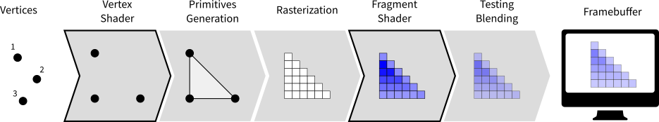

Introduction
===============================================================================

.. contents:: .
   :local:
   :depth: 2
   :class: toc chapter-02

Before diving into OpenGL programming, it is important to have a look at the
whole GL landscape because it is actually quite complex and you can easily lose
yourself between the different actors, terms and definitions. The teaser image
above shows the face of a character from the Wolfenstein game, one from 1992
and the other from 2015. You can see that computer graphics has evolved a lot
in 25 years.

A bit of history
-------------------------------------------------------------------------------

OpenGL is 25 years old! Since the first release in 1992, a lot has happened
(and is still happening actually, with the newly released Vulkan_ API and the
4.6 GL release) and consequently, before diving into the book, it is important
to understand OpenGL API evolution over the years. If the first API (1.xx) has
not changed too much in the first twelve years, a big change occured in 2004
with the introduction of the dynamic pipeline (OpenGL 2.x), i.e. the use of
shaders that allow to have direct access to the GPU. Before this version,
OpenGL was using a fixed pipeline that made it easy to rapidly prototype some
ideas. It was simple but not very powerful because the user had not much
control over the graphic pipeline. This is the reason why it has been
deprecated_ more than ten years ago and you don't want to use it today. Problem
is that there are a lot of tutorials online that still use this fixed pipeline
and because most of them were written before modern GL, they're not even aware
(and cannot) that they use a deprecated API.

How to know if a tutorial address the fixed pipeline ? It's relatively
easy. It'll contain GL commands such as:

.. code::
   :class: neutral

   glVertex, glColor, glLight, glMaterial, glBegin, glEnd, glMatrix,
   glMatrixMode, glLoadIdentity, glPushMatrix, glPopMatrix, glRect,
   glPolygonMode, glBitmap, glAphaFunc, glNewList, glDisplayList,
   glPushAttrib, glPopAttrib, glVertexPointer, glColorPointer,
   glTexCoordPointer, glNormalPointer, glRotate, glTranslate, glScale,
   glMatrixMode, glCall,

If you see any of them in a tutorial, run away because it it's most certainly a
tutorial that address the fixed pipeline and you don't want to read it because
what you will learn is already useless. If you look at the GL history below,
you'll realize that the "modern" GL API is already 13 years old while the fixed
pipeline has been deprecated more than 10 years ago.

.. code::
   :class: neutral

    1                       2         Modern              2 
    9                       0         OpenGL              0               Vulkan   
    9                       0           ↓                 1                 ↓
    2  3  4  5  6  7  8  9  0  1  2  3  4  5  6  7  8  9  0  1  2  3  4  5  6  7
   ─────────────────────────────────────┬───────────────────────────────────┬────
   OpenGL                                                3.3                
                                                         4.0                
                                                      3.1                   
                     1.2         1.4   2.0            3.2   4.2   4.4       
   1.0            1.1         1.3   1.5      2.1   3.0   4.1   4.3   4.5      4.6
   ╌╌╌╌╌╌╌╌╌╌╌╌╌╌╌╌╌╌╌╌╌╌╌╌╌╌╌╌╌╌╌╌╌╌╌╌╌┬╌╌╌╌╌╌╌╌╌╌╌╌╌╌╌╌╌╌╌╌╌╌╌╌╌╌╌╌╌╌╌╌╌╌╌╌╌╌╌╌
              Fixed pipeline            ╎           Programmable pipeline       
   ╌╌╌╌╌╌╌╌╌╌╌╌╌╌╌╌╌╌╌╌╌╌╌╌╌╌╌╌╌╌╌╌╌╌╌╌╌┴╌╌╌╌╌╌╌╌╌╌╌╌╌╌╌╌╌╌╌╌╌╌╌╌╌╌╌╌╌╌╌╌╌╌╌╌╌╌╌╌
   GLES                                    ╭─────╮                      3.2  
                                 1.0       │ 2.0 │             3.0   3.1
                                           ╰─────╯
   ╌╌╌╌╌╌╌╌╌╌╌╌╌╌╌╌╌╌╌╌╌╌╌╌╌╌╌╌╌╌╌╌╌╌╌╌╌╌╌╌╌╌╌╌╌╌╌╌╌╌╌╌╌╌╌╌╌╌╌╌╌╌╌╌╌╌╌╌╌╌╌╌╌╌╌╌╌╌
   GLSL                                                  4.0   4.3   4.5      4.6
                                                   1.3   4.1      4.4        
                                                      1.4   4.2              
                                       1.1   1.2      1.5                    
   ╌╌╌╌╌╌╌╌╌╌╌╌╌╌╌╌╌╌╌╌╌╌╌╌╌╌╌╌╌╌╌╌╌╌╌╌╌╌╌╌╌╌╌╌╌╌╌╌╌╌╌╌╌╌╌╌╌╌╌╌╌╌╌╌╌╌╌╌╌╌╌╌╌╌╌╌╌╌
   WebGL                                             1.0                      2.0
   ╌╌╌╌╌╌╌╌╌╌╌╌╌╌╌╌╌╌╌╌╌╌╌╌╌╌╌╌╌╌╌╌╌╌╌╌╌╌╌╌╌╌╌╌╌╌╌╌╌╌╌╌╌╌╌╌╌╌╌╌╌╌╌╌╌╌╌╌╌╌╌╌╌╌╌╌╌╌
   Vulkan                                                                  1.0
   ──────────────────────────────────────────────────────────────────────────────

From `OpenGL wiki`_: *In 1992, Mark Segal and Kurt Akeley authored the OpenGL
1.0 specification which formalized a graphics API and made cross platform 3rd
party implementation and support viable. In 2004, OpenGL 2.0 incorporated the
significant addition of the OpenGL Shading Language (also called GLSL), a C
like language with which the transformation and fragment shading stages of the
pipeline can be programmed. In 2008, OpenGL 3.0 added the concept of
deprecation: marking certain features as subject to removal in later versions.*

`Open Graphics Library`_ (OpenGL)
  OpenGL is a cross-language, cross-platform application programming interface
  (API) for rendering 2D and 3D vector graphics. The API is typically used to
  interact with a graphics processing unit (GPU), to achieve
  hardware-accelerated rendering.

`OpenGL for Embedded Systems`_ (OpenGL ES or GLES)
  GLES is a subset of the OpenGL computer graphics rendering application
  programming interface (API) for rendering 2D and 3D computer graphics such as
  those used by video games, typically hardware-accelerated using a graphics
  processing unit (GPU).

`OpenGL Shading Language`_ (GLSL)
  GLSL is a high-level shading language with a syntax based on the C
  programming language. It was created by the OpenGL ARB (OpenGL Architecture
  Review Board) to give developers more direct control of the graphics pipeline

`Web Graphics Library`_ (WebGL)
  WebGL is a JavaScript API for rendering 3D graphics within any compatible web
  browser without the use of plug-ins. WebGL is integrated completely into all
  the web standards of the browser allowing GPU accelerated usage of physics
  and image processing and effects as part of the web page canvas.

`Vulkan`_ (VK)
  Vulkan is a low-overhead, cross-platform 3D graphics and compute API first
  announced at GDC 2015 by the Khronos Group. Like OpenGL, Vulkan targets
  high-performance realtime 3D graphics applications such as video games and
  interactive media across all platforms, and can offer higher performance and
  more balanced CPU/GPU usage, much like Direct3D 12 and Mantle.

For this book, we'll use the GLES 2.0 API that allows to use the modern GL API
while staying relatively simple.  For comparison, have a look at the table
below that gives the number of functions and constants for each version of the
GL API.  Note that once you'll master the GLES 2.0, it's only a matter of
reading the documentation to take advantage of more advanced version because
the core concepts remain the same (which is not the case for the new Vulkan
API).

.. note::

  The number of functions and constants have been computed using the
  `<code/registry.py>`_ program that parses the gl.xml_ file that defines the
  OpenGL and OpenGL API Registry
 
======== ========= ========= === ============ ========= =========
Version  Constants Functions     Version      Constants Functions
======== ========= ========= === ============ ========= =========
GL 1.0           0       306     GL 3.2             800       316
-------- --------- --------- --- ------------ --------- ---------
GL 1.1         528       336     GL 3.3             816       344
-------- --------- --------- --- ------------ --------- ---------
GL 1.2         569       340     GL 4.0             894       390
-------- --------- --------- --- ------------ --------- ---------
GL 1.3         665       386     GL 4.1             929       478
-------- --------- --------- --- ------------ --------- ---------
GL 1.4         713       433     GL 4.2            1041       490
-------- --------- --------- --- ------------ --------- ---------
GL 1.5         763       452     GL 4.3            1302       534
-------- --------- --------- --- ------------ --------- ---------
GL 2.0         847       545     GL 4.4            1321       543
-------- --------- --------- --- ------------ --------- ---------
GL 2.1         870       551     GL 4.5            1343       653
-------- --------- --------- --- ------------ --------- ---------
GL 3.0        1104       635     GLES 1.0           333       106
-------- --------- --------- --- ------------ --------- ---------
GL 3.1        1165       647     **GLES 2.0**   **301**   **142**
======== ========= ========= === ============ ========= =========

Modern OpenGL
-------------------------------------------------------------------------------

The graphic pipeline
++++++++++++++++++++

.. Note::

   The shader language is called glsl.  There are many versions that goes from 1.0
   to 1.5 and subsequents version get the number of OpenGL version. Last version
   is 4.6 (June 2017).

If you want to understand modern OpenGL, you have to understand the graphic
pipeline and shaders. Shaders are pieces of program (using a C-like language)
that are build onto the GPU and executed during the rendering
pipeline. Depending on the nature of the shaders (there are many types
depending on the version of OpenGL you're using), they will act at different
stage of the rendering pipeline. To simplify this tutorial, we'll use only
**vertex** and **fragment** shaders as shown below:

A vertex shader acts on vertices and is supposed to output the vertex
**position** (`gl_Position`) on the viewport (i.e. screen). A fragment shader
acts at the fragment level and is supposed to output the **color**
(`gl_FragColor`) of the fragment. Hence, a minimal vertex shader is:

.. code:: glsl

  void main()
  {
      gl_Position = vec4(0.0,0.0,0.0,1.0);
  }

while a minimal fragment shader would be:

.. code:: glsl

  void main()
  {
      gl_FragColor = vec4(0.0,0.0,0.0,1.0);
  }

These two shaders are not very useful because the first shader will always
output the null vertex (`gl_Position` is a special variable) while the second
will only output the black color for any fragment (`gl_FragColor` is also a
special variable). We'll see later how to make them to do more useful things.

One question remains: when are those shaders exectuted exactly ? The vertex
shader is executed for each vertex that is given to the rendering pipeline
(we'll see what does that mean exactly later) and the fragment shader is
executed on each fragment (= pixel) that is generated after the vertex
stage. For example, in the simple figure above, the vertex would be called 3
times, once for each vertex (1,2 and 3) while the fragment shader would be
executed 21 times, once for each fragment.

Buffers
+++++++

The next question is thus where do those vertices comes from ? The idea of
modern GL is that vertices are stored on the GPU and needs to be uploaded to
the GPU before rendering. The way to do that is to build buffers onto the CPU
and to send these buffers onto the GPU. If your data does not change, no need
to upload them again. That is the big difference with the previous fixed
pipeline where data were uploaded at each rendering call (only display lists
were built into GPU memory).

But what is the structure of a vertex ? OpenGL does not assume anything about
your vertex structure and you're free to use as many information you may need
for each vertex. The only condition is that all vertices from a buffer have the
same structure (possibly with different content). This again is a big
difference with the fixed pipeline where OpenGL was doing a lot of complex
rendering stuff for you (projections, lighting, normals, etc.) with an implicit
fixed vertex structure. The good news is that you're now free to do anything
you want, but the bad news is that you have to program just everything.

Let's take a simple example of a vertex structure where we want each vertex to
hold a position and a color. The easiest way to do that in python is to use a
structured array using numpy_:

.. code:: python

  data = numpy.zeros(4, dtype = [ ("position", np.float32, 3),
                                  ("color",    np.float32, 4)] )

We just created a CPU buffer with 4 vertices, each of them having a
`position` (3 floats for x,y,z coordinates) and a `color` (4 floats for
red, blue, green and alpha channels). Note that we explicitely chose to have 3
coordinates for `position` but we may have chosen to have only 2 if were to
work in two-dimensions. Same holds true for `color`. We could have used
only 3 channels (r,g,b) if we did not want to use transparency. This would save
some bytes for each vertex. Of course, for 4 vertices, this does not really
matter but you have to realize it **will matter** if you data size grows up to
one or ten million vertices.

Variables
+++++++++

Now, we need to explain our shaders what to do with these buffers and how to
connect them together. So, let's consider again a CPU buffer of 4 vertices
using 2 floats for position and 4 floats for color:

.. code:: python

  data = numpy.zeros(4, dtype = [ ("position", np.float32, 2),
                                  ("color",    np.float32, 4)] )

We need to tell the vertex shader that it will have to handle vertices where a
position is a tuple of 2 floats and color is a tuple of 4 floats. This is
precisely what **attributes** are meant for. Let us change slightly our previous
vertex shader:

.. code:: glsl

  attribute vec2 position;
  attribute vec4 color;
  void main()
  {
      gl_Position = vec4(position, 0.0, 1.0);
  }

This vertex shader now expects a vertex to possess 2 attributes, one named
`position` and one named `color` with specified types (vec3 means tuple of
3 floats and vec4 means tuple of 4 floats). It is important to note that even
if we labeled the first attribute `position`, this attribute is not yet bound
to the actual `position` in the numpy array. We'll need to do it explicitly
at some point in our program and there is no omagic that will bind the numpy
array field to the right attribute, you'll have to do it yourself, but we'll
see that later.

The second type of information we can feed the vertex shader is the **uniform**
that may be considered as constant value (across all the vertices). Let's say
for example we want to scale all the vertices by a constant factor `scale`,
we would thus write:

.. code:: glsl

  uniform float scale;
  attribute vec2 position;
  attribute vec4 color;
  void main()
  {
      gl_Position = vec4(position*scale, 0.0, 1.0);
  }

Last type is the varying type that is used to pass information between the
vertex stage and the fragment stage. So let us suppose (again) we want to pass
the vertex color to the fragment shader, we now write:

.. code:: glsl

  uniform float scale;
  attribute vec2 position;
  attribute vec4 color;
  varying vec4 v_color;

  void main()
  {
      gl_Position = vec4(position*scale, 0.0, 1.0);
      v_color = color;
  }

and then in the fragment shader, we write:

.. code:: glsl

  varying vec4 v_color;

  void main()
  {
      gl_FragColor = v_color;
  }

The question is what is the value of `v_color` inside the fragment shader ?
If you look at the figure that introduced the gl pipleline, we have 3 vertices
and 21 fragments. What is the color of each individual fragment ?

The answer is *the interpolation of all 3 vertices color*. This interpolation
is made using distance of the fragment to each individual vertex. This is a
very important concept to understand. Any varying value is interpolated between
the vertices that compose the elementary item (mostly, line or triangle).

Ok, enough for now, we'll see an explicit example in the next chapter.

State of the union
-------------------------------------------------------------------------------

Last, but not least, we need to access the OpenGL library from within Python
and we have mostly two solutions at our disposal. Either we use pure bindings
and we have to program everything (see next chapter) or we use an engine that
provide a lot oc convenient functions that ease the development. We'll first
use the PyOpenGL bindings before using the glumpy_ library that offers a tight
integration with numpy.

Bindings
++++++++

* `Pyglet`_ is a pure python cross-platform application framework intended for
  game development. It supports windowing, user interface event handling,
  OpenGL graphics, loading images and videos and playing sounds and music. It
  works on Windows, OS X and Linux.

* `PyOpenGL`_ is the most common cross platform Python binding to OpenGL and
  related APIs. The binding is created using the standard ctypes library, and
  is provided under an extremely liberal BSD-style Open-Source license.

* `ModernGL`_ is a wrapper over OpenGL that simplifies the creation of simple
  graphics applications like scientific simulations, small games or user
  interfaces. Usually, acquiring in-depth knowledge of OpenGL requires a steep
  learning curve. In contrast, ModernGL is easy to learn and use, moreover it
  is capable of rendering with the same performance and quality, with less code
  written.

* Ctypes_ bindings can also be generated quite easily thanks to the gl.xml_
  file provided by the Khronos group that defines the OpenGL and OpenGL API
  Registry. The number of functions and constants given in the table above have
  been computed using the `<code/registry.py>`_ program that parses the gl.xml
  file for each API and version and count the relevant features.

  
Engines
+++++++

* The Visualization Toolkit (`VTK`_) is an open-source, freely available
  software system for 3D computer graphics, image processing, and
  visualization. It consists of a C++ class library and several interpreted
  interface layers including Tcl/Tk, Java, and Python.
  
* `Processing`_ is a programming language, development environment, and online
  community. Since 2001, Processing has promoted software literacy within the
  visual arts and visual literacy within technology. Today, there are tens of
  thousands of students, artists, designers, researchers, and hobbyists who use
  Processing for learning, prototyping, and production.
  
* `NodeBox`_ for OpenGL is a free, cross-platform library for generating 2D
  animations with Python programming code. It is built on Pyglet and adopts the
  drawing API from NodeBox for Mac OS X. It has built-in support for paths,
  layers, motion tweening, hardware-accelerated image effects, simple physics
  and interactivity.

* `Panda3D`_ is a 3D engine: a library of subroutines for 3D rendering and game
  development. The library is C++ with a set of Python bindings. Game
  development with Panda3D usually consists of writing a Python or C++ program
  that controls the Panda3D library.

* `VPython`_ makes it easy to create navigable 3D displays and animations, even
  for those with limited programming experience. Because it is based on Python,
  it also has much to offer for experienced programmers and researchers.

Libraries
+++++++++

.. Note::

   Even though glumpy and vispy shares a number of concept, they are different.
   vispy offers a high-level interface that may be convenient in some
   situations but this tends to hide the internal machinery. This is one of the
   reason we'll be using glumpy instead (the other reason being that I'm the
   author of glumpy (and one of the author of vispy as well in fact)).
   
* `Glumpy`_ is a python library for scientific visualization that is both fast,
  scalable and beautiful. Glumpy leverages the computational power of modern
  Graphics Processing Units (GPUs) through the OpenGL library to display very
  large datasets and offers an intuitive interface between numpy and modern
  OpenGL. We'll use it extensively in this book.

* `Vispy`_ is the sister project of glumpy. It is a high-performance
  interactive 2D/3D data visualization library and offer a high-level interface
  for scientific visualization. The difference between glumpy and vispy is
  approximately the same as the difference between numpy and scipy even though
  vispy is independent of glumpy and vice-versa.
  

.. --- Links ------------------------------------------------------------------
.. _Open Graphics Library:
       https://en.wikipedia.org/wiki/OpenGL
.. _OpenGL for Embedded Systems:
       https://en.wikipedia.org/wiki/OpenGL_ES`
.. _OpenGL Shading Language:
       https://en.wikipedia.org/wiki/OpenGL_Shading_Language
.. _Web Graphics Library:
       https://en.wikipedia.org/wiki/WebGL
.. _Vulkan:
       https://en.wikipedia.org/wiki/Vulkan_(API)
.. _ModernGL:
       https://moderngl.readthedocs.io/en/stable/
.. _NodeBox:
       http://www.cityinabottle.org/nodebox/
.. _Pyglet:
       https://bitbucket.org/pyglet/pyglet/wiki/Home
.. _PyOpenGL:
       http://pyopengl.sourceforge.net
.. _Panda3D:
       http://www.panda3d.org/
.. _Processing:
       http://py.processing.org
.. _VTK:
       http://www.vtk.org
.. _VPython:
       http://vpython.org
.. _numpy:
       http://www.numpy.org
.. _glumpy:
       http://glumpy.github.io
.. _vispy:
       http://vispy.org
.. _OpenGL wiki:
       https://www.khronos.org/opengl/wiki/History_of_OpenGL
.. _deprecated:
       https://khronos.org/registry/OpenGL/specs/gl/glspec30.pdf#page=421
.. _ctypes:
       https://docs.python.org/3/library/ctypes.html
       
.. _gl.xml:
       https://github.com/KhronosGroup/OpenGL-Registry/blob/master/xml/gl.xml
.. _registry.py:
       code/registry.py

.. ----------------------------------------------------------------------------
