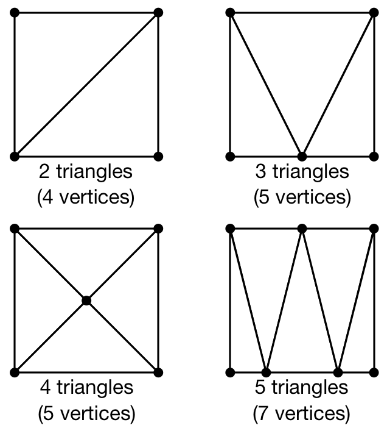
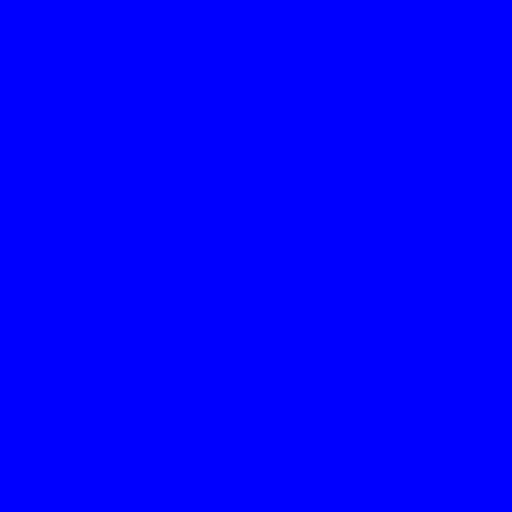

Quickstart                                                                    
===============================================================================

.. contents:: .
   :local:
   :depth: 2
   :class: toc chapter-03

For the **really** impatient, you can try to run the code in the `teaser image
<code/chapter-03/glumpy-quad-solid.py>`_ above. If this works, a window should
open on your desktop with a red color in the background. If you now want to
understand how this works, you'll have to read the text below.
           

Preliminaries                                                                  
-------------------------------------------------------------------------------

The main difficulty for newcomers in programming modern OpenGL is that it
requires to understand a lot of different concepts at once and then, to perform
a lot of operations before rendering anything on screen. This complexity
implies that there are many places where your code can be wrong, both at the
conceptual and code level. To illustrate this difficulty, we'll program our
first OpenGL program using the raw interface and our goal is to display a
simple colored quad (i.e. a red square).

Normalize Device Coordinates                                                   
+++++++++++++++++++++++++++++++++++++++++++++++++++++++++++++++++++++++++++++++

.. figure:: images/chapter-03/NDC.png
   :figwidth: 40%
            
   Figure

   Normalized Device Coordinates (NDC) where bottom-left corner coordinates is
   (-1,-1) and top-right corner is (+1,+1).
   

Before even diving into actual code, it is important to understand first how
OpenGL handles coordinates. More precisely, OpenGL considers only coordinates
`(x,y,z)` that fall into the space where `-1 ≤ x,y,z ≤ +1`. Any coordinates
that are outside this range will be discarded or clipped (i.e. won't be visible
on screen). This is called Normalized Device Coordinates, or NDC for short.
This is something you cannot change because it is part of the OpenGL API and
implemented in your hardware (GPU). Consequently, even if you intend to render
the whole universe, you'll have utlimately to fit it into this small volume.

The second important fact to know is that **x** coordinates increase from left
to right and **y** coordinates increase from bottom to top. For this latter
one, it is noticeably different from the usual convention and this might induce
some problems, especially when you're dealing with the mouse pointer whose
**y** coordinate goes this other way around.

Triangulation                                                                  
+++++++++++++++++++++++++++++++++++++++++++++++++++++++++++++++++++++++++++++++

            
   Figure

   Different triangulation of the same quad using from 2 to 5 triangles.

`Triangulation <https://en.wikipedia.org/wiki/Surface_triangulation>`_ of a
surface means to find a set of triangles, which covers a given surface. This
can be a tedious process but fortunately, there exist many different methods
and algorithms to perform such triangulation automatically for any 2D or 3D
surface. The quality of the triangulation is measured in term of the closeness
to the approximated surface, the number of triangles necessary (the smaller,
the better) and the homogeneity of the triangles (we prefer to have triangles
that have more or less the same size and to not have any degenerated triangle).

In our case, we want to render a square and we need to find the proper
triangulation (which is not unique as illustrated on the figure). Since we want
to minimize the number of triangles, we'll use the 2 triangles solution that
requires only 4 (shared) vertices corresponding to the four corners of the
quad. However, you can see of the figure that we could have used different
triangulations using more vertices, and later in this book we will just do that
(but for a reason).
   
Considering the NDC, our quad will thus be composed of two triangles:

* One triangle described by vertices `(-1,+1), (+1,+1), (-1,-1)`
* One triangle described by vertices `(+1,+1), (-1,-1), (+1,-1)`

Here we can see that vertices `(-1,-1)` and `(+1,+1)` are structurally the
same. So instead of using 6 vertices to describe the two triangles, we can
re-use the common vertices to describe the whole quad. Let's name them:

* `V₀`: `(-1,+1)`
* `V₁`: `(+1,+1)`
* `V₂`: `(-1,-1)`
* `V₃`: `(+1,-1)`

Our quad can now be using triangle `(V₀,V₁,V₂)` and triangle `(V₁,V₂,V₃)`. This
is exactly what we need to tell OpenGL.

GL Primitives                                                                  
+++++++++++++++++++++++++++++++++++++++++++++++++++++++++++++++++++++++++++++++

.. figure:: images/chapter-03/gl-primitives.png
   :figwidth: 40%

   Figure

   Common OpenGL rendering primitives.
              
Ok, now things are getting serious because we need to actually tell OpenGL what
to do with the vertices, i.e. how to render them? what do they describe in term
of geometrical primitives? This is quite an important topic since this will
determines how fragments will be actually generated as illustrated on the image
below:

Mostly, OpenGL knows how to draw (ugly) point, (ugly) lines and ugly
(triangles). For lines and triangles, there exist some variations depending if
you want to specify very precisely what to draw or if you can take advantage of
some implicit assumptions. Let's consider lines first for example. Given a set
of four vertices `(V₀,V₁,V₂,V₃)`, you migh want to draw segments
`(V₀,V₁)``(V₂,V₃)` using `GL_LINES` or a broken line `(V₀,V₁,V₂,V₃)` using
using `GL_LINE_STRIP` or a closed broken line `(V₀,V₁,V₂,V₃,V₀,)` using
`GL_LINE_LOOP`. For triangles, you have the choices of specifying each triangle
individually using `GL_TRIANGLES` or you can tell OpenGL that triangles follow
an implicit structure using `GL_TRIANGLE_STRIP`. For example, considering a set
of vertices (Vᵢ), `GL_TRIANGLE_STRIP` will produce triangles `(Vᵢ,Vᵢ₊₁,Vᵢ₊₂)`.
There exist other primitives but we won't used them in this book because
they're mainly related to *geometry shaders* that are not introduced.

If you remember the previous section where we explained that our quad can be
described using using triangle `(V₀,V₁,V₂)` and triangle `(V₁,V₂,V₃)`, you can
now realize that we can take advantage or the `GL_TRIANGLE_STRIP` primitive
because we took care of describing the two triangles following this implicit
structure.

Interpolation                                                                  
+++++++++++++++++++++++++++++++++++++++++++++++++++++++++++++++++++++++++++++++

.. figure:: images/chapter-03/interpolation.png
   :figwidth: 40%
            
   Figure

   The Barycentric interpolation `f` of a fragment `p` is given by `f = 𝛌₁f₁ +
   𝛌₂f₂ + 𝛌₃f₃`

The choice of the triangle as the only surface primitive is not arbitrary
choice because a triangle offers the possibility of having a nice and intuitive
interpolation of any point that is inside the triangle. If you look back at
the graphic pipeline as it has been introduced in the `Modern OpenGL`_ section,
you can see that the rasterisation requires for OpenGL to generate fragments
inside the triangle but also to interpolate values (colors on the figure). One
of the legitimate question to be solved is then: if I have a triangle
(V₁,V₂,V₃), each summit vertex having (for example) a different color, what is
the color of a fragment `p` inside the triangle? The answer is `barycentric
interpolation <https://en.wikibooks.org/wiki/GLSL_Programming/Rasterization>`_
as illustrated on the figure on the right.

More precisely, for any point p inside a triangle `A = (V₁,V₂,V₃)`, we consider
triangles:

* `A₁ = (P,V₂,V₃)`
* `A₂ = (P,V₁,V₃)`
* `A₃ = (P,V₁,V₂)`

And we can define (using area of triangles):
  
* `𝛌₁ = A₁/A`
* `𝛌₂ = A₂/A`
* `𝛌₃ = A₃/A`

Now, if we attach a value `f₁` to vertex `V₁`, `f₂` to vertex `V₂` and `f₃` to
vertex `V₃`, the interpolated value `f` of `p` is given by: `f = 𝛌₁f₁ + 𝛌₂f₂ +
𝛌₃f₃` You can check by yourself that if the point `p` is on a border of the
triangle, the resulting interpolated value `f` is the linear interpolation of
the two vertices defining the segment the point `p` belongs to.

This **barycentric interpolation is important to understand** even if it is done
automatically by OpenGL (with some variation to take projection into
account). We took the example of colors, but the same interpolation scheme
holds true for any value you pass from the vertex shader to the fragment
shader. And this property will be used and abused in this book.

The hard way                                                                   
-------------------------------------------------------------------------------

Having reviewed some important OpenGL concepts, it's time to code our quad
example. But, before even using OpenGL, we need to open a window with a valid GL
context. This can be done using toolkit such as Gtk_, Qt_ or Wx_ or any native
toolkit (Windows, Linux, OSX). Unfortunately, the Tk_ Python interface does not
allow to create a GL context and we cannot use it. Note there also exists
dedicated toolkits such as GLFW_ or GLUT_ and the advantage of GLUT is that
it's already installed alongside OpenGL. Even if it is now deprecated, we'll
use GLUT since it's a very lightweight toolkit and does not require any extra
package. Here is a minimal setup that should open a window with garbage on it
(since we do not even clear the window):

.. code:: python

   import sys
   import OpenGL.GL as gl
   import OpenGL.GLUT as glut

   def display():
       glut.glutSwapBuffers()

   def reshape(width,height):
       gl.glViewport(0, 0, width, height)

   def keyboard( key, x, y ):
       if key == 'b'\x1b':
           sys.exit( )

   glut.glutInit()
   glut.glutInitDisplayMode(glut.GLUT_DOUBLE | glut.GLUT_RGBA)
   glut.glutCreateWindow('Hello world!')
   glut.glutReshapeWindow(512,512)
   glut.glutReshapeFunc(reshape)
   glut.glutDisplayFunc(display)
   glut.glutKeyboardFunc(keyboard)
   glut.glutMainLoop()

.. Note::

   You won't have access to any GL command before the `glutInit()` has been
   executed because no OpenGL context will be available before this command is
   executed.

The `glutInitDisplayMode` tells OpenGL what are the GL context properties. At
this stage, we only need a swap buffer (we draw on one buffer while the other
is displayed) and we use a full RGBA 32 bits color buffer (8 bits per channel).
The `reshape` callback informs OpenGL of the new window size while the
`display` method tells OpenGL what to do when a redraw is needed. In this
simple case, we just ask OpenGL to swap buffers (this avoids flickering).
Finally, the keyboard callback allows us to exit by pressing the `Escape` key.

Writing shaders                                                                
+++++++++++++++++++++++++++++++++++++++++++++++++++++++++++++++++++++++++++++++

Now that your window has been created, we can start writing our program, that
is, we need to write a vertex and a fragment shader. For the vertex shader, the
code is very simple because we took care of using the normalized device
coordinates to describe our quad in the previous section. This means vertices
do not need to be transformed.  Nonetheless, we have to take care of sending 4D
coordinates even though we'll transmit only 2D coordinates (`x,y`) or the final
result will be undefined. For coordinate `z` we'll just set it to `0.0` (but
any value would do) and for coordinate `w`, we set it to `1.0` (see section
`Basic Mathematics`_ for the explanation). Note also the (commented)
alternative ways of writing the shader.

.. code:: glsl

     attribute vec2 position;
     void main()
     {
       gl_Position = vec4(position, 0.0, 1.0);
       
       // or gl_Position.xyzw = vec4(position, 0.0, 1.0);

       // or gl_Position.xy = position;
       //    gl_Position.zw = vec2(0.0, 1.0);

       // or gl_Position.x = position.x;
       //    gl_Position.y = position.y;
       //    gl_Position.z = 0.0;
       //    gl_Position.w = 1.0;
     }

For the fragment shader, it is even simpler. We set the color to red which is
described by the tuple `(1.0, 0.0, 0.0, 1.0)` in normalized RGBA
notation. `1.0` for alpha channel means fully opaque.

.. code:: glsl

     void main()
     {
       gl_FragColor = vec4(1.0, 0.0, 0.0, 1.0);

       // or gl_FragColor.rgba = vec4(1.0, 0.0, 0.0, 1.0);

       // or gl_FragColor.rgb = vec3(1.0, 0.0, 0.0);
       //    gl_FragColor.a = 1.0;
     }

Compiling the program                                                          
+++++++++++++++++++++++++++++++++++++++++++++++++++++++++++++++++++++++++++++++

We wrote our shader and we need now to build a program that will link the
vertex and the fragment shader together. Building such program is relatively
straightforward (provided we do not check for errors). First we need to request
program and shader slots from the GPU:
     
.. code:: python
          
    program  = gl.glCreateProgram()
    vertex   = gl.glCreateShader(gl.GL_VERTEX_SHADER)
    fragment = gl.glCreateShader(gl.GL_FRAGMENT_SHADER)

We can now ask for the compilation of our shaders into GPU objects and we log
for any error from the compiler (e.g. syntax error, undefined variables, etc):

.. code:: python

   vertex_code = """
     attribute vec2 position;
     void main() { gl_Position = vec4(position, 0.0, 1.0); } """

   fragment_code = """
     void main() { gl_FragColor = vec4(1.0, 0.0, 0.0, 1.0); } """
          
   # Set shaders source
   gl.glShaderSource(vertex, vertex_code)
   gl.glShaderSource(fragment, fragment_code)

   # Compile shaders
   gl.glCompileShader(vertex)
   if not gl.glGetShaderiv(vertex, gl.GL_COMPILE_STATUS):
       error = gl.glGetShaderInfoLog(vertex).decode()
       print(error)
       raise RuntimeError("Vertex shader compilation error")
   
   gl.glCompileShader(fragment)
   if not gl.glGetShaderiv(fragment, gl.GL_COMPILE_STATUS):
       error = gl.glGetShaderInfoLog(fragment).decode()
       print(error)
       raise RuntimeError("Fragment shader compilation error")

Then we link our two objects in into a program and again, we check for errors
during the process.

.. code:: python

   gl.glAttachShader(program, vertex)
   gl.glAttachShader(program, fragment)
   gl.glLinkProgram(program)

   if not gl.glGetProgramiv(program, gl.GL_LINK_STATUS):
       print(gl.glGetProgramInfoLog(program))
       raise RuntimeError('Linking error')

and we can get rid of the shaders, they won't be used again (you can think of
them as `.o` files in C).

.. code:: python

   gl.glDetachShader(program, vertex)
   gl.glDetachShader(program, fragment)

Finally, we make program the default program to be ran. We can do it now
because we'll use a single program in this example:

.. code:: python

   gl.glUseProgram(program)

Uploading data to the GPU                                                      
+++++++++++++++++++++++++++++++++++++++++++++++++++++++++++++++++++++++++++++++

Next, we need to build CPU data and the corresponding GPU buffer that will hold
a copy of the CPU data (GPU cannot access CPU memory). In Python, things are
grealty facilitated by NumPy that allows to have a precise control over number
representations. This is important because GLES 2.0 floats have to be exactly
32 bits long and a regular Python float would not work (they are actually
equivalent to a C `double`). So let us specify a NumPy array holding 4×2
32-bits float that will correspond to our 4×(x,y) vertices:

.. code:: python

   # Build data
   data = np.zeros((4,2), dtype=np.float32))

Wen then create a placeholder on the GPU without yet specifying the size:

.. code:: python

   # Request a buffer slot from GPU
   buffer = gl.glGenBuffers(1)

   # Make this buffer the default one
   gl.glBindBuffer(gl.GL_ARRAY_BUFFER, buffer)

We now need to bind the buffer to the program, that is, for each attribute
present in the vertex shader program, we need to tell OpenGL where to find the
corresponding data (i.e. GPU buffer) and this requires some computations. More
precisely, we need to tell the GPU how to read the buffer in order to bind each
value to the relevant attribute. To do this, GPU needs to know what is the
stride between 2 consecutive element and what is the offset to read one
attribute:

.. code::
   :class: neutral

                    1ˢᵗ vertex  2ⁿᵈ vertex  3ʳᵈ vertex   …
                   ┌───────────┬───────────┬───────────┬┄┄
                   ┌─────┬─────┬─────┬─────┬─────┬─────┬─┄
                   │  X  │  Y  │  X  │  Y  │  X  │  Y  │ …
                   └─────┴─────┴─────┴─────┴─────┴─────┴─┄
        offset 0 → │ (x,y)     └───────────┘
                                   stride

In our simple quad scenario, this is relatively easy to write because we have a
single attribute ("`position`"). We first requires the attribute location
inside the program and then we bind the buffer with the relevant offset.
                                   
.. code:: python

   stride = data.strides[0]

   offset = ctypes.c_void_p(0)
   loc = gl.glGetAttribLocation(program, "position")
   gl.glEnableVertexAttribArray(loc)
   gl.glBindBuffer(gl.GL_ARRAY_BUFFER, buffer)
   gl.glVertexAttribPointer(loc, 2, gl.GL_FLOAT, False, stride, offset)

We're basically telling the program how to bind data to the relevant
attribute. This is made by providing the stride of the array (how many bytes
between each record) and the offset of a given attribute.

Let's now fill our CPU data and upload it to the newly created GPU buffer:

.. code:: python

   # Assign CPU data
   data[...] = (-1,+1), (+1,+1), (-1,-1), (+1,-1)

   # Upload CPU data to GPU buffer
   gl.glBufferData(gl.GL_ARRAY_BUFFER, data.nbytes, data, gl.GL_DYNAMIC_DRAW)

Rendering                                                                      
+++++++++++++++++++++++++++++++++++++++++++++++++++++++++++++++++++++++++++++++

We're done, we can now rewrite the display function:

.. code:: python
   
   def display():
       gl.glClear(gl.GL_COLOR_BUFFER_BIT)
       gl.glDrawArrays(gl.GL_TRIANGLE_STRIP, 0, 4)
       glut.glutSwapBuffers()

.. figure:: images/chapter-03/glumpy-quad-solid.png
   :figwidth: 30%
            
   Figure

   A red quad rendered using Python, raw OpenGL bindings and the venerable
   GLUT.

The `0,4` arguments in the `glDrawArrays` tells OpenGL we want to display 4
vertices from our current active buffer and we start at vertex 0. You should
obtain the figure on the right with the same red (boring) color. The whole
source ia available from `<code/chapter-03/glut-quad-solid.py>`_.

All these operations are necessary for displaying a single colored quad on
screen and complexity can escalate pretty badly if you add more objects,
projections, lighting, texture, etc. This is the reason why we'll stop using
the raw OpenGL interface in favor of a library. We'll use the glumpy_ library,
mostly because I wrote it, but also because it offers a tight integration with
numpy. Of course, you can design your own library to ease the writing of GL
Python applications.

Uniform color                                                                  
+++++++++++++++++++++++++++++++++++++++++++++++++++++++++++++++++++++++++++++++

            
   Figure

   A blue quad rendered using a `uniform` variable specifying the color of the
   quad.

In the previous example, we hard-coded the red color inside the fragment shader
source code. But what if we want to change the color from within the Python
program? We could rebuild the program with the new color but that would not be
very efficient. Fortunately there is a simple solution provided by OpenGL:
`uniform`. Uniforms, unlike attributes, do not change from one vertex to the
other and this is precisely what we need in our case. We thus need to slightly
modify our fragment shader to use this uniform color:

.. code:: glsl

     uniform vec4 color;
     void main()
     {
       gl_FragColor = color;
     }

Of course, we also need to upload a color to this new uniform location and this
is easier than for attribute because the memory has already been allocated on
the GPU (since the size is know and does not depend on the number of vertices).

.. code:: python
          
   loc = gl.glGetUniformLocation(program, "color")
   gl.glUniform4f(loc, 0.0, 0.0, 1.0, 1.0)

If you run the new `<code/glut-quad-uniform-color.py>`_ example, you should
obtain the blue quad as shown on the right.

Varying color                                                                  
+++++++++++++++++++++++++++++++++++++++++++++++++++++++++++++++++++++++++++++++

.. figure:: images/chapter-03/glumpy-quad-varying-color.png
   :figwidth: 30%
            
   Figure

   A colored quad using a per-vertex color.

Until now, we have been using a constant color for the four vertices of our
quad and the result is (unsurprisingly) a boring uniform red or blue quad. We
can make a bit more interesting though by assigning different colors for each
vertex and see how OpenGL will interpolate colors. Our new vertex shader would
need to be rewritten as:

.. code:: glsl

     attribute vec2 position;
     attribute vec4 color;
     varying vec4 v_color;
     void main()
     {
       gl_Position = vec4(position, 0.0, 1.0);
       v_color= color;
     }

We just added our new attribute `color` but we also added a new variable type:
`varying`. This type is actually used to transmit a value from the vertex
shader to the fragment shader. As you might have guessed, the `varying` type
means this value won't be constant over the different fragments but will be
interpolated depending on the relative position of the fragment in the
triangle, as I explained in the `Interpolation`_ section. Note that we also
have to rewrite our fragment shader accordingly, but now the `v_color` will be
an input:

.. code:: glsl

     varying vec4 v_color;
     void main()
     {
       gl_FragColor = color;
     }
     
We now need to upload vertex color to the GPU. We could create a new vertex
dedicated buffer and bind it to the new `color` attribute, but there is a more
interesting solution. We'll use instead a single numpy array and a single buffer,
taking advantage of the NumPy structured array:

.. code:: python

   data = np.zeros(4, [("position", np.float32, 2),
                       ("color",    np.float32, 4)])
   data['position'] = (-1,+1), (+1,+1), (-1,-1), (+1,-1)
   data['color']    = (0,1,0,1), (1,1,0,1), (1,0,0,1), (0,0,1,1)

Our CPU data structure is thus:
   
.. code::
   :class: neutral

              1ˢᵗ vertex              2ⁿᵈ vertex  
      ┌───────────────────────┬───────────────────────┬┄
      ┌───┬───┬───┬───┬───┬───┬───┬───┬───┬───┬───┬───┬─┄
      │ X │ Y │ R │ G │ B │ A │ X │ Y │ R │ G │ B │ A │ …
      └───┴───┴───┴───┴───┴───┴───┴───┴───┴───┴───┴───┴─┄
      ↑       ↑               └───────────────────────┘
    position  color                     stride
    offset    offset

Binding the buffer is now a bit more complicated but it is made relatively easy
thanks to NumPy:

.. code:: python

   stride = data.strides[0]
   offset = ctypes.c_void_p(0)
   loc = gl.glGetAttribLocation(program, "position")
   gl.glEnableVertexAttribArray(loc)
   gl.glBindBuffer(gl.GL_ARRAY_BUFFER, buffer)
   gl.glVertexAttribPointer(loc, 2, gl.GL_FLOAT, False, stride, offset)

   offset = ctypes.c_void_p(data.dtype["position"].itemsize)
   loc = gl.glGetAttribLocation(program, "color")
   gl.glEnableVertexAttribArray(loc)
   gl.glBindBuffer(gl.GL_ARRAY_BUFFER, buffer)
   gl.glVertexAttribPointer(loc, 4, gl.GL_FLOAT, False, stride, offset)

   

The easy way                                                                   
-------------------------------------------------------------------------------

As we've seen in the previous section, displaying a simple quad using modern GL
is quite tedious and requires a fair number of operations and this why from now
on we'll use glumpy_ whose goal is to make this process both easy and
intuitive.

Glumpy is organized around three main modules:

* The Application layer (`app`) package is responsible for opening a window and
  handling user events such as mouse and keyboard interactions.
* The OpenGL object oriented layer (`gloo`) package is responsible for
  handling shader programs and syncing CPU/GPU data through the numpy
  interface.
* The Graphic layer (`graphics`) package provides higher-level common objects
  such as text, collections and widgets.

Those modules will help us writing any OpenGL program quite easily. Let's
consider again our quad example:

.. Note::

   Glumpy will look for any available backend in a given order, starting by
   GLFW_. I strongly advise to install the GLFW package on your system since
   this backend is activately maintainted and "just works".

We still need to open a window, but now this is straightforward:

.. code:: python

   from glumpy import app, gloo, gl

   # Create a window with a valid GL context
   window = app.Window()

If necessary, you can also indicate which backend to use by writing
`app.choose("glfw")` before creating the window. The creation of the program is
also straightforward:

.. code:: python

   # Build the program and corresponding buffers (with 4 vertices)
   quad = gloo.Program(vertex, fragment, count=4)

With the above line, both the CPU data and GPU data (buffer) have been created
and no extra command is necessary at this stage and uploading the data is only
a matter of setting the different fields of the `quad` program:

.. code:: python

   # Upload data into GPU
   quad['position'] = (-1,+1), (+1,+1), (-1,-1), (+1,-1)

Under the hood, glumpy has parsed your shader programs and has identied
attributes. Rendering is just a matter of calling the `draw` method from our
shader program, using the proper mode.

.. code:: python

   # Tell glumpy what needs to be done at each redraw
   @window.event
   def on_draw(dt):
       window.clear()
       quad.draw(gl.GL_TRIANGLE_STRIP)

   # Run the app
   app.run()

The whole source is available in `<code/chapter-03/glumpy-quad-solid.py>`_.

If you run this program using the `--debug` switch, you should obtain the
following output that show what is being done in the background. More
specifically, you can check that the program is actually compiled and linked
using specified shaders and that the buffer is created and bound to the
program.

.. code::
   :class: output

   [i] HiDPI detected, fixing window size
   [i] Using GLFW (GL 2.1)
   [i] Running at 60 frames/second
   GPU: Creating program
   GPU: Attaching shaders to program
   GPU: Creating shader
   GPU: Compiling shader
   GPU: Creating shader
   GPU: Compiling shader
   GPU: Linking program
   GPU: Activating program (id=1)
   GPU: Activating buffer (id=7)
   GPU: Creating buffer (id=7)
   GPU: Updating position
   GPU: Deactivating buffer (id=7)
   GPU: Deactivating program (id=1)

..
   Glumpy takes care of building the buffer because we specified the vertex count
   value and will also bind the relevant attributes and uniforms to the program.
   You should obtain the same output as in previous section.
   `<code/chapter-03/quad-glumpy.py>`_

Uniform color                                                                  
+++++++++++++++++++++++++++++++++++++++++++++++++++++++++++++++++++++++++++++++

Adding a `uniform` specified color is only a matter of modifying the
fragment shader as in the previous section and directly assigning the color to
the quad program (see `<code/chapter-03/glumpy-quad-uniform-color.py>`_):

.. code:: python

   quad["color"] = 0,0,1,1

Varying color                                                                  
+++++++++++++++++++++++++++++++++++++++++++++++++++++++++++++++++++++++++++++++

Adding a per-vertex color is also only a matter of modifying the
fragment shader as in the previous section and directly assigning the color to
the quad program (see `<code/chapter-03/glumpy-quad-varying-color.py>`_):

.. code:: python

   quad["color"] = (1,1,0,1), (1,0,0,1), (0,0,1,1), (0,1,0,1)

   
..
   Animating
   +++++++++

   .. figure:: movies/chapter-03/quad-scale.mp4
      :loop:
      :autoplay:
      :controls:
      :figwidth: 35%

      Figure

      An `animated quad <code/chapter-03/quad-scale.py>`_.

   The nice thing with glumpy_ is that it takes care of any change in uniform or
   attribute values. If you change them through the program interface, these
   values will be updated on the GPU just-in-time. So, let's have some animation
   by making the scale value to oscillate betwen -1 and 1. To do this, we need to keep
   track of time and to update the scale value accordingly:

   .. code:: python

      time = 0.0

      # Tell glumpy what needs to be done
      # at each redraw
      @window.event
      def on_draw(dt):
          global time
          time += 1.0 * math.pi/180.0
          window.clear()
          quad["scale"] = math.cos(time)
          quad.draw(gl.GL_TRIANGLE_STRIP)

      app.run(framerate=60, framecount=360)

   .. note::

      You'll need to have the ffmpeg_ library installed if you want to record a movie.

   When running the program, we set the `framecount` to 360, meaning the program
   will exit after 360 elapsed frames (a whole `cos` cycle actually).  This will
   allow us to record a movie that can loop indefinetly. If you want to record
   your own movie, run `the program <code/chapter-03/quad-scale.py>`_ with:

   .. code:: shell

      $ python quad-scale.py --record quad-scale.mp4

   
     
Exercises                                                                      
-------------------------------------------------------------------------------

Now we can play a bit with the shader and hopefully you'll understand why
learning to program the dynamic graphic pipeline is worth the effort. Modifying
the rendering is now a matter of writing the proper shader. We'll get a first
taste in the three exercises below but we'll see much more powerful shader
tricks in the next chapters.

.. figure:: movies/chapter-03/quad-scale.mp4
   :loop:
   :autoplay:
   :controls:
   :figwidth: 35%

   Figure

   Basic animation with the quad.

**Scaling the quad** We've been using previously a `uniform` to pass a color to
the fragment shader, but we could have used also in the vertex shader to pass
any kind of information. In this exercise, try to modify the vertex shader in
the `varying color example <code/chapter-03/glumpy-quad-varying-color.py>`_ in
order for the quad to be animated and to scale with time as shown in the figure
on the right. You will need to update the scale factor within the Python
program, for example in the `draw` function.

Solution: `<code/chapter-03/quad-scale.py>`_

----

.. figure:: movies/chapter-03/quad-rotate.mp4
   :loop:
   :autoplay:
   :controls:
   :figwidth: 35%

   Figure

   Basic animation with the quad.

**Rotating the quad** Let's now rotate the quad as in the figure on the right.
Note that you have access to the `cos` and `sin` functions from within the
shader. If you forgot your geometry, here is a quick reminder for a rotation of
angle theta around the origin (0,0) for a point (x,y):

.. code:: glsl

       float x2 = cos(theta)*x - sin(theta)*y;
       float y2 = sin(theta)*x + cos(theta)*y;

Solution: `<code/chapter-03/quad-rotation.py>`_

.. _GLUT:   http://freeglut.sourceforge.net 		
.. _GLFW:   http://www.glfw.org		
.. _GTK:    https://www.gtk.org		
.. _QT:     https://www.qt.io		
.. _WX:     https://www.wxwidgets.org		
.. _TK:     https://docs.python.org/3/library/tk.html		
.. _ffmpeg: https://www.ffmpeg.org
