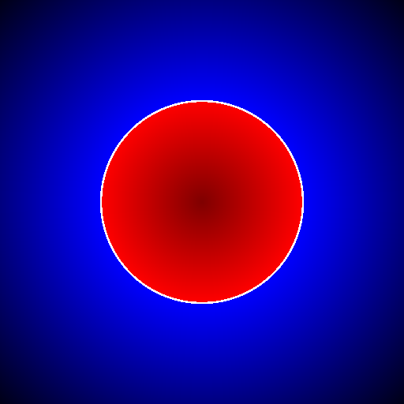
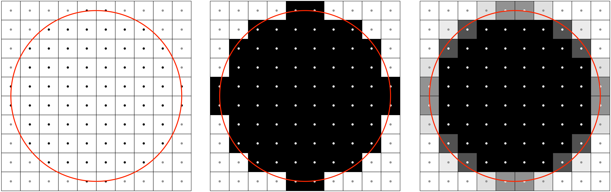

Anti-grain geometry
===============================================================================

.. contents:: .
   :local:
   :depth: 2
   :class: toc chapter-06

.. image:: data/mcseem.jpg
   :class: right
   :width: 20%
      
The late Maxim Shemanarev (1966-2013) designed the anti-grain_ library, a
(very) high quality rendering engine written in C++. The library is both nicely
written (one of the best C++ library I've seen with the Eigen_ library) and
heavily documented, but the strongest feature is the quality of the rendering
output that is probably one of the best, even 10 years after the library has
been released (have look at the demos_). This is the level of quality we target
in this book. However, OpenGL anti-aliasing techniques (even latest ones) won't
do the job and we'll need to take care of pretty much everything.

.. _anti-grain: http://www.antigrain.com/
.. _eigen:      http://eigen.tuxfamily.org/
.. _demos:      http://www.antigrain.com/demo/

Antialiasing
-------------------------------------------------------------------------------

.. figure:: data/circle-aa-none.png
   :figwidth: 50%
   :figclass: right

   Figure

   Rendering of a non-aliased disc. Even if the center of a pixel is very close
   to the shape but oustide, the associated pixel is not painted as shown for
   the thick black square.

Aliasing is a well known problem in signal processing where it can occur in
time (temporal aliasing) or in space (spatial aliasing). In computer graphics,
we're mostly interested in spatial aliasing (such a `Moiré pattern`_ or
jaggies_) and the way to attenuate it.  Let's first examine the origin of the
problem from a practical point of view (have a look at wikipedia for the
`background theory`_).

The figure on the right illustrates the problem when we wants to render a disc
onto a small area. The very first thing to be noticed is that pixels are
**not** mathematical points and the center of the pixel is usually associated
with the center of the pixel. This means that if we consider a pair of integer
coordinates `(i,j)`, then `(i+Δx, j+Δy)` designates the same pixel (with `-0.5
< Δx, Δy < 0.5`).  In order to rasterize the mathematical description of our
circle (center and radius), the rasterizer examine the center of each pixel to
determine if it falls inside or outside the shape. The result is illustrated on
the right part of the figure. Even if the center of a pixel is very close but
outside of the circle, it is not painted as it is shown for the thicker square
on the figure. More generally, without antia-aliasing, a pixel will be only on
(inside) or off (outside), leading to very hard jagged edges and a very
approximate shape for small sizes as well.

.. _Moiré pattern: https://en.wikipedia.org/wiki/Moiré_pattern
.. _jaggies: https://en.wikipedia.org/wiki/Jaggies
.. _background theory: https://en.wikipedia.org/wiki/Aliasing

Sample based methods
++++++++++++++++++++

.. figure:: data/circle-aa-multisample.png
   :figwidth: 45%
   :figclass: right

   Figure

   Rendering of a disc using multisample anti-aliasing. By mutisampling the
   same pixel, the edge can be rendered smoother. The thick black square pixel
   that was previously considered outside the shape can not be considered
   half-outside (2 samples outside) and half-inside (2 samples inside).

One of the simplest method to remove antialising consists in using several
samples to estimate the final color of a fragment. Instead of only considering
the center of the pixel, one case use several samples over the whole surface of
a pixel in order to have a better estimate as shown on the figure on the
right. A fragment that was previously considered outside, based on its center
only, can now be considered half inside / half outside. This multi-sampling
helps to attenuate the jagged edges we've seen in the previous section. On the
figure, we used a very simple and straightforward multi-sample method,
assigning fixed and equidistant locations for the four subsamples. There exist
however better methods for multi-sampling as shown by the impressive list of
sample based antialiasing techniques:

* SSAA_: Supersampling antialiasing
* MSAA_: Multisample antialiasing
* FSAA_: Full screen anti-aliasing
* FXAA_: Fast approximate antialiasing
* SMAA_: Subpixel morphological antialiasing
* DLAA_: Directionally localized antialiasing
* NFAA_: Normal filter antialiasing
* HRAA_: High-Resolution antialiasing
* TXAA_: Temporal antialiasing
* EQAA_: Enhanced quality at-prntialiasing
* CSAA_: Coverage Sample antialiasing

Depending on the performance you need to achieve (in terms of rendering quality
and speed) one method might be better than the other. However, you cannot
expect to achieve top quality due to inherent limitations of all these
methods. If they are great for real-time rendering such as video games (and
some of them are really good), they are hardly sufficient for any scientific
visualization as illustrated on the figure below.

.. figure:: data/ssaa-sdf.png
   :figwidth: 100%

   Figure

   Supersampling applied to a rasterized triangle, using various sub-pixel
   patterns. The more samples , the better the output but even using 64
   samples, the rendering quality does not match the SDF rendering, especially
   if you consider triangle sharp vertices.  Supersampled triangles have been
   rendered using a dedicated shader (see `<code/triangle-ssaa.py>`_) and the
   SDF triangle has been rendered using a fake signed-distance triangle
   function (see below) and a stroke anti-alias function (see
   `<code/triangle-sdf.py>`_)

.. _CSAA: http://www.anandtech.com/show/2116/9
.. _EQAA: http://www.anandtech.com/show/4061/amds-radeon-hd-6970-radeon-hd-6950/10
.. _SSAA: https://en.wikipedia.org/wiki/Supersampling  
.. _MSAA: https://en.wikipedia.org/wiki/Multisample_anti-aliasing  
.. _FXAA: https://en.wikipedia.org/wiki/Fast_approximate_anti-aliasing
.. _FSAA: https://en.wikipedia.org/wiki/Supersampling
.. _HRAA: http://www.nvidia.com/object/feature_hraa.html
.. _SMAA: http://www.iryoku.com/smaa/
.. _DLAA: http://and.intercon.ru/releases/talks/dlaagdc2011/slides/
.. _NFAA: https://www.gamedev.net/forums/topic/580517-nfaa---a-post-process-anti-aliasing-filter-results-implementation-details/
.. _TXAA: https://www.geforce.com/hardware/technology/txaa

This is the reason why we won't use them in the rest of this book. If you want
more details on these techniques, you can have a look at this reddit discussion
explaining `antialiasing modes`_ or this nice `overview of MSAA`_

.. _antialiasing modes:
    https://www.reddit.com/r/Games/comments/1rb964/antialiasing_modes_explained/
.. _overview of MSAA:
    https://mynameismjp.wordpress.com/2012/10/24/msaa-overview/

Coverage methods
++++++++++++++++

.. figure:: data/circle-aa-exact.png
   :figwidth: 50%
   :figclass: right

   Figure

   Rendering of a disc using exact coverage anti-aliasing.

Another approach for anti-aliasing is to compute the exact coverage of a shape
over each pixel surface as shown on the figure on the right. To do so, we need
of course to know precisely the shape we want to display and where it is
located in order to compute the coverage of the shape onto the pixel grid. On
the image, this corresponds to the grey areas that give us direct access to the
final color of the pixel (more precisely, the percentage of the color we have
to mix with the background color or any other object in the vicinity).
Unfortunately, such method is not possible to enforce in a full 3D scene
because all the transformations and differen occlusuins would make the
computation of the final shape too complex. In two dimensions however, this is
probably the best method we can use and this is also the method that is used in
the `Anti-grain geometry
<http://www.antigrain.com/doc/introduction/introduction.agdoc.html>`_ library
that constitutes the quality standard we aim at.

.. figure:: data/coverage.png
   :figwidth: 40%
   :figclass: right
              
   Figure

   Actual versus approximated coverage.

But even in 2D, computing the exact coverage of the shape over the different
pixels can become rapidly a complex and slow task. One way to greatly simplify
the problem is to consider pixel to be round (instead of square or
rectangle). With such asumption, we only need to compute the distance from the
center of the pixel to the border of the shape (that is locally considered to
be a line) to get a very accurate estimate of the coverage and this is exactly
what we'll do in the next section.

If you wonder if our round pixel shape approximation makes any. sense at all,
have a look at the `subpixel zoo
<https://geometrian.com/programming/reference/subpixelzoo/index.php>`_
maintained by Ian Mallett and you'll understand our assumption is not so bad
overall. 

Signed distance fields
-------------------------------------------------------------------------------

Here comes the fun. After having reviewed different method for anti-aliasing,
we (mostly me actually) retained the coverage method that necessitates to
evaluate the distance from the center of a pixel to the border of the shape. To
do that, we'll use signed distance functions.

Signed distance function
++++++++++++++++++++++++

From wikipedia (again):

  *A signed distance function (or oriented distance function) of a set Ω in a
  metric space determines the distance of a given point x from the boundary of
  Ω, with the sign determined by whether x is in Ω. The function has positive
  values at points x inside Ω, it decreases in value as x approaches the
  boundary of Ω where the signed distance function is zero, and it takes
  negative values outside of Ω.*

Said differently and in order to render a shape, we need to find a function of
`x` and `y` that returns a value that is the signed distance to the shape, that
is, a signed distance to the border of the shape. Inside the shape, the value
is positive, outside the shape the value is negative and on the border, the
value is null. Easy enough.

.. note::

   The sign of inside/outside can be reversed as long as they are opposite. 

Of course, the question is now how do we find such function? Let's start with
the most simple geometrical primitive: a circle centered on `(xc,yc)` with a
radius `r`. For any point `(x,y)`, we know the (positive or null) distance to
the center is given by: `d = sqrt((x-xc)*(x-xc)+(y-yc)*(y-yc))`. To simplify
computations, we'll consider the circle to centered on the origin, the distance
now writes `d = sqrt(x*x+y*y)`. This distance is not what we want since we
target a signed distance to the border of the circle. However, this can be
obtained very easily by subtracting the radius `r` from `d(x,y)`. In the end,
signed distance from a point `(x,y)` to a circle of radius `r` centered on the
origin is given by:

.. code::
   :class: math

   d(x,y) = sqrt(x*x+y*y) - r

              
   Figure

   Signed distance to a circle. Inside is red, outside is blue, border is white.
   
   See `<code/circle-sdf-distances.py>`_

As an exercise, you can check that `d(x,y)` is null if `(x,y)` is on the
border, strictly negative if `(x,y)` is inside the circle and strictly positive
outside the circle.

Now, let's check if OpenGL is consistent with our maths. We'll write a fragment
shader that compute the color according to the distance to the shape. We'll use
the red color outside the circle, blue color inside and white color on the
border (with some tolerance of we won't see anything).

.. code:: glsl

   float distance(vec2 P, vec2 center, float radius)
   {
       return length(P-center) - radius;
   }

   varying vec2 v_position;
   void main()
   {
       const float epsilon = 0.005;
       float d = distance(v_position, vec2(0.0), 0.5);
       if (d > +epsilon)
           gl_FragColor = vec4(abs(d), 0.0, 0.0, 1.0);
       else if (d < -epsilon)
           gl_FragColor = vec4(0.0, 0.0, abs(d), 1.0);
       else 
           gl_FragColor = vec4(0.0, 0.0, 0.0, 1.0);
   }
   

Geometrical primitives
++++++++++++++++++++++

We need now to define a few primitives usigned signed distance function. You'll
understand in the next section why we only need a few primitives. In the
meantime, we'll use a less boring palette than the one in the previous
section. We'll use instead the palette that has become the standard for
displaying SDF on `Shadertoy <https://www.shadertoy.com>`_ (it has been
designed by `Íñigo Quílez <http://iquilezles.org/www/index.htm>`_ to the best
of my knowledge):

.. code:: glsl

   vec4 color(float d)
   {
       vec3 white = vec3(1.0, 1.0, 1.0);
       vec3 blue  = vec3(0.1, 0.4, 0.7);
       vec3 color = white - sign(d)*blue;
       color *= (1.0 - exp(-4.0*abs(d))) * (0.8 + 0.2*cos(140.0*d));
       color = mix(color, white, 1.0-smoothstep(0.0,0.02,abs(d)) );
       return vec4(color, 1.0);
   }

.. note::

   The `#include` directive is not part ot the glsl specification and is only
   available from within glumpy.

However, we don't want to copy this code in all the example. We can instead
write a `palette.glsl <code/palette.glsl>`_ shader and include it in each of
the example.

   

Circle
~~~~~~

Distance to a circle is the easiest to compute.

.. figure:: data/SDF-circle.mp4
   :loop:
   :autoplay:
   :controls:
   :figwidth: 25%
   :figclass: right

   Figure

   `SDF-circle.py <code/SDF-circle.py>`_

   
.. code:: glsl

   float SDF_circle(vec2 p, float radius)
   {
       return length(p) - radius;
   }

Plane
~~~~~

The distance from a point P to a plane (line in 2d) is the distance from P to
the projection of P onto the place.

.. figure:: data/SDF-plane.mp4
   :loop:
   :autoplay:
   :controls:
   :figwidth: 25%
   :figclass: right

   Figure

   `SDF-plane.py <code/SDF-plane.py>`_

   
.. code:: glsl

   float SDF_plane(vec2 p, vec2 p0, vec2 p1)
   {
     vec2 T = p1 - p0;
     vec2 O = normalize(vec2(T.y, -T.x));
     return dot(O, p0 - p);
   }

True Box
~~~~~~~~

When computing distance to a box, one has to take care of the distance to the
vertices defining the box.

.. figure:: data/SDF-box.mp4
   :loop:
   :autoplay:
   :controls:
   :figwidth: 25%
   :figclass: right

   Figure

   `SDF-box.py <code/SDF-box.py>`_

   
.. code:: glsl

   // Code by Inigo Quilez
   // See https://www.shadertoy.com/view/4llXD7
   float SDF_box(vec2 p, vec2 size)
   {
        vec2 d = abs(p) - size;
        return min(max(d.x,d.y),0.0) + length(max(d,0.0));
   }

Rounded Box
~~~~~~~~~~~

.. figure:: data/SDF-round-box.mp4
   :loop:
   :autoplay:
   :controls:
   :figwidth: 25%
   :figclass: right

   Figure

   `SDF-round-box.py <code/SDF-round-box.py>`_

Distance to a round can be immediately derived from the distance to a box by
subtracting the corner radius.
   
.. code:: glsl

   // Code derived from the true triangle code by Inigo Quilez
   // See https://www.shadertoy.com/view/4llXD7
   float SDF_round_box(vec2 p, vec2 size, float radius)
   {
       return SDF_box(p, size) - radius;
   }
   

Fake Box
~~~~~~~~

.. figure:: data/SDF-fake-box.mp4
   :loop:
   :autoplay:
   :controls:
   :figwidth: 25%
   :figclass: right

   Figure

   `SDF-fake-box.py <code/SDF-fake-box.py>`_

A faster way to compute a SDF box is to consider it to be delimited by lines
(instead of line segments). We save the time of computing the distance to the
box vertices.
   
.. code:: glsl

  float SDF_fake_box(vec2 p, vec2 size)
  {
      return max(abs(p.x)-size.x, abs(p.y)-size.y);
  }

True triangle
~~~~~~~~~~~~~

.. figure:: data/SDF-triangle.mp4
   :loop:
   :autoplay:
   :controls:
   :figwidth: 25%
   :figclass: right

   Figure

   `SDF-triangle.py <code/SDF-triangle.py>`_

Computing the distance to a triangle is not totally straightfoward because a
triangle is made of three line segments, meaning we have to take into account
both the distance to the side of the triangle and the distance to the triangle
vertices.

   
.. code:: glsl

   // Code by Inigo Quilez
   // See https://www.shadertoy.com/view/XsXSz4
   float SDF_triangle(vec2 p, vec2 p0, vec2 p1, vec2 p2)
   {
       vec2 e0 = p1 - p0;
       vec2 e1 = p2 - p1;
       vec2 e2 = p0 - p2;

       vec2 v0 = p - p0;
       vec2 v1 = p - p1;
       vec2 v2 = p - p2;

       vec2 pq0 = v0 - e0*clamp( dot(v0,e0)/dot(e0,e0), 0.0, 1.0 );
       vec2 pq1 = v1 - e1*clamp( dot(v1,e1)/dot(e1,e1), 0.0, 1.0 );
       vec2 pq2 = v2 - e2*clamp( dot(v2,e2)/dot(e2,e2), 0.0, 1.0 );

       float s = sign( e0.x*e2.y - e0.y*e2.x );
       vec2 d = min( min(
             vec2( dot( pq0, pq0 ), s*(v0.x*e0.y-v0.y*e0.x) ),
             vec2( dot( pq1, pq1 ), s*(v1.x*e1.y-v1.y*e1.x) )),
             vec2( dot( pq2, pq2 ), s*(v2.x*e2.y-v2.y*e2.x) ));
       return -sqrt(d.x)*sign(d.y);
   }

Round triangle
~~~~~~~~~~~~~~

.. figure:: data/SDF-round-triangle.mp4
   :loop:
   :autoplay:
   :controls:
   :figwidth: 25%
   :figclass: right

   Figure

   `SDF-round-triangle.py <code/SDF-round-triangle.py>`_

Round triangle is very easy to obtain from the triangle above. We just
substract the radius of the corner such that the border of the triangle is on
the oustide part of the SDF triangle.

.. code:: glsl

   // Code derived from the true triangle code by Inigo Quilez
   // See https://www.shadertoy.com/view/XsXSz4
   float SDF_round_triangle(vec2 p, vec2 p0, vec2 p1, vec2 p2, float radius)
   {
       return SDF_triangle(p, p0, p1, p2) - radius;
   }

Fake triangle
~~~~~~~~~~~~~

.. figure:: data/SDF-fake-triangle.mp4
   :loop:
   :autoplay:
   :controls:
   :figwidth: 25%
   :figclass: right

   Figure

   `SDF-fake-triangle.py <code/SDF-fake-triangle.py>`_

What I call a fake SDF triangle is a triangle made of lines instead of line
segments. If you look at the corner (outside part), you will notice the
different compared to the real triangle. This fake triangle will used later for
markers because it is faster to compute than the regular SDF triangle.
   
.. code:: glsl

   float SDF_fake_triangle(vec2 p, vec2 p0, vec2 p1, vec2 p2)
   {
       vec2 e0 = p1 - p0;
       vec2 e1 = p2 - p1;
       vec2 e2 = p0 - p2;

       vec2 v0 = p - p0;
       vec2 v1 = p - p1;
       vec2 v2 = p - p2;

       vec2 o0 = normalize(vec2(e0.y, -e0.x));
       vec2 o1 = normalize(vec2(e1.y, -e1.x));
       vec2 o2 = normalize(vec2(e2.y, -e2.x));

       return max(max(dot(o0,v0), dot(o1,v1)), dot(o2,v2));
   }

          
True ellipse
~~~~~~~~~~~~

.. figure:: data/SDF-ellipse.mp4
   :loop:
   :autoplay:
   :controls:
   :figwidth: 25%
   :figclass: right

   Figure

   `SDF-ellipse.py <code/SDF-ellipse.py>`_

Computing the distance from an arbitrary point to an ellipse is surprinsingly
difficult if you compare it to the distance to a circle. If you want to read
the details, I would advise to read the paper `Quick computation of the
distance between a point and an ellipse
<https://www.spaceroots.org/documents/distance/distance-to-ellipse.pdf>`_ by
Luc Maisonobe. The good news for us is that Íñigo Quílez already solved the
problem for us. We will re-use his formula.
   
.. code:: glsl

   // Code by Inigo Quilez
   // See https://www.shadertoy.com/view/4sS3zz
   float SDF_ellipse(vec2 p, vec2 ab)
   {
       // The function does not like circles
       if (ab.x == ab.y) ab.x = ab.x*0.9999;

       p = abs( p ); if( p.x > p.y ){ p=p.yx; ab=ab.yx; }
       float l = ab.y*ab.y - ab.x*ab.x;
       float m = ab.x*p.x/l; 
       float n = ab.y*p.y/l; 
       float m2 = m*m;
       float n2 = n*n;
       float c = (m2 + n2 - 1.0)/3.0; 
       float c3 = c*c*c;
       float q = c3 + m2*n2*2.0;
       float d = c3 + m2*n2;
       float g = m + m*n2;
       float co;

       if( d<0.0 ) {
           float p = acos(q/c3)/3.0;
           float s = cos(p);
           float t = sin(p)*sqrt(3.0);
           float rx = sqrt( -c*(s + t + 2.0) + m2 );
           float ry = sqrt( -c*(s - t + 2.0) + m2 );
           co = ( ry + sign(l)*rx + abs(g)/(rx*ry) - m)/2.0;
       } else {
           float h = 2.0*m*n*sqrt( d );
           float s = sign(q+h)*pow( abs(q+h), 1.0/3.0 );
           float u = sign(q-h)*pow( abs(q-h), 1.0/3.0 );
           float rx = -s - u - c*4.0 + 2.0*m2;
           float ry = (s - u)*sqrt(3.0);
           float rm = sqrt( rx*rx + ry*ry );
           float p = ry/sqrt(rm-rx);
           co = (p + 2.0*g/rm - m)/2.0;
       }
       float si = sqrt( 1.0 - co*co );
       vec2 r = vec2( ab.x*co, ab.y*si );
       return length(r - p ) * sign(p.y-r.y);
   }

          
Fake (but fast) ellipse
~~~~~~~~~~~~~~~~~~~~~~~

.. figure:: data/SDF-fake-ellipse.mp4
   :loop:
   :autoplay:
   :controls:
   :figwidth: 25%
   :figclass: right

   Figure

   `SDF-fake-ellipse.py <code/SDF-fake-ellipse.py>`_

Íñigo Quílez also provided a very fast apprximation of the ellipse
distance. Some artifacts can be clearly seen but we'll see later that if our ellipse is not too thick, this approximation will do the job.

   
.. code:: glsl

   // Code by Inigo Quilez
   // See https://www.shadertoy.com/view/MdfGWn
   float SDF_fake_ellipse(vec2 p, vec2 size)
   {
       float r = 0.2;
       float f = length( p*size );
       f = length(p*size);
       return f*(f-r)/length(p*size*size);
   }

   

Distance based anti-aliasing
-------------------------------------------------------------------------------

We have our signed distance functions but we need to exploit them in order to
do the proper antialiasing. If you remember that a SDF function gives the
distance to the border of the shape, we still need to compute the right color
according to this distance. When we are fully inside or outside the shape, it
is easy: let's say black for the inside and white for the oustide (or nothing
using the transaprency level). The interesting part is located in the vicinity
of the border, it is not fully black nor fully white but grey. What amount of
grey you might ask? Well, it is directly correlated with the distance to the
border. But first, let's have a look at the figure below that show the
different situations:

   Figure

   For a given shape, we might want to draw only the outline of the shape
   (left), the interior only (left) or both of them (middle).

For all these cases, we need to define the thickness of the antialiased area,
(that is, the area where the estimated coverage will go from 0 (outside) to 1
(inside)) and the line thickness for the stroke and outline cases. This means
that wen we compute the actual size of the circle, we have to take this into
account (2*antialias + linewidth). The antialias area is usually 1.0 pixel.
If it is larger, the shape will appear blurry, and it it is too narrow, the
shape will have hard egdes. The degenerated case being a null area that results
in no antialias at all.
   
.. figure:: data/antialias-function.png

   Figure

   Antialiasing functions: **Left**: None, **Middle**: linear, **Right**:
   exponential.

Finally, we need to define a function that gives the coverage according to the
distance. As illustrated above, we have the choice between several solutions
(you're also free to design your own) but we'll mostly use the last one for the
rest of this book because it appears to be the nicest (to me).
