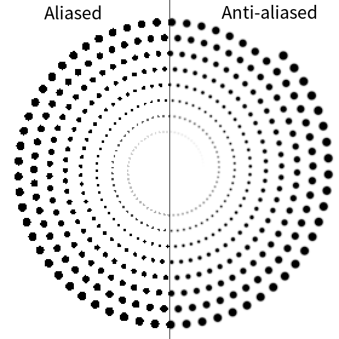
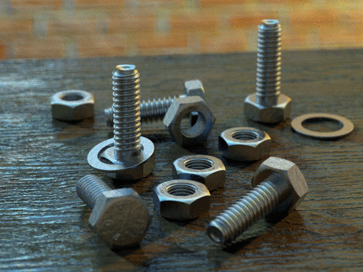

Rendering points
===============================================================================

.. contents:: .
   :local:
   :depth: 2
   :class: toc chapter-06

If you have read the previous chapters, you may have noticed that there exists
actually a `gl.GL_POINTS` drawing primitive and you might have concluded (quite
logically) that displaying points in OpenGL is straightforward. This is partly
true. This primitive can be actually used to display points, but the concept of
point for OpenGL is roughly a non-antialiased, non-rotated, boring and ugly
square. Consequently, if we want to display points like in the teaser image
above (each symbol is a shader-transformed point), we'll need to take care of
pretty much everything.

Antialiasing
-------------------------------------------------------------------------------

   Figure

   Aliased (left part) and anti-aliased (right part) circle. Source:
   `<code/disc-spiral-aa.py>`_

Aliasing is a well known problem in signal processing where it can occurs in
time (temporal aliasing) or in space (spatial aliasing). In computer graphics,
we're mostly interested in spatial aliasing (such a `Moiré pattern
<https://en.wikipedia.org/wiki/Moiré_pattern>`_ of `jaggies
<https://en.wikipedia.org/wiki/Jaggies>`_) and the way to attenuate it as show
on the image on the right. But let first explain the origin of the problem from
a practical point of view (have a look at wikipedia for the `background theory
<https://en.wikipedia.org/wiki/Aliasing>`_).

Sample based methods
++++++++++++++++++++

See reddit discussion: `Antialiasing modes explained
<https://www.reddit.com/r/Games/comments/1rb964/antialiasing_modes_explained/>`_

* SSAA_: Supersampling antialiasing
* MSAA_: Multisample antialiasing
* FSAA_: Full screen anti-aliasing
* FXAA_: Fast approximate antialiasing
* SMAA_: Enhanced subpixel morphological antialiasing
* DLAA_: Directionally localized antialiasing
* NFAA_: Normal filter antialiasing
* HRAA_: High-Resolution antialiasing
* TXAA_: Temporal antialiasing
* EQAA_: Enhanced quality antialiasing
* CSAA_: Coverage Sample antialiasing

.. _CSAA: http://www.anandtech.com/show/2116/9
.. _EQAA: http://www.anandtech.com/show/4061/amds-radeon-hd-6970-radeon-hd-6950/10
.. _SSAA: https://en.wikipedia.org/wiki/Supersampling  
.. _MSAA: https://en.wikipedia.org/wiki/Multisample_anti-aliasing  
.. _FXAA: https://en.wikipedia.org/wiki/Fast_approximate_anti-aliasing
.. _FSAA: https://en.wikipedia.org/wiki/Supersampling
.. _HRAA: http://www.nvidia.com/object/feature_hraa.html
.. _SMAA: http://www.iryoku.com/smaa/
.. _DLAA: http://and.intercon.ru/releases/talks/dlaagdc2011/slides/
.. _NFAA: https://www.gamedev.net/forums/topic/580517-nfaa---a-post-process-anti-aliasing-filter-results-implementation-details/
.. _TXAA: https://www.geforce.com/hardware/technology/txaa

Coverage methods
++++++++++++++++

`Antigrain geometry
<http://www.antigrain.com/doc/introduction/introduction.agdoc.html>`_

Signed distance fields
-------------------------------------------------------------------------------

Signed distance function
++++++++++++++++++++++++

Geometrical primitives
++++++++++++++++++++++

Constructive Solid Geometry
+++++++++++++++++++++++++++

See also `Truth function <https://en.wikipedia.org/wiki/Truth_function>`_.

              
   Figure

   Still life with bolts by `Jaime Vives Piqueres
   <http://www.ignorancia.org/>`_.

Constructive solid geometry (CSG) is a technique used for modeling in order to
create a complex object by using Boolean operators to combine simpler objects
(primitives). Resulting objects appear visually complex but are actually a
cleverly combined or decombined objects as shown on the right image that has
been coded by `Jaime Vives Piqueres <http://www.ignorancia.org/>`_. All the
objects on this image (including the table) results from clever and complex
constructive geometry in 3D. The final image has been rendered with PovRay
using the light system developed by Jaime.

----

.. figure:: data/CSG.png
   :figwidth: 50%
   :figclass: right
              
   Figure

   Constructive solid geometry (CSG) allows a to create a complex object by using
   Boolean operators to combine simpler objects.

----

.. figure:: data/CSG-intersection.png
   :figwidth: 30%
   :figclass: right

   Figure

   | Intersection (A and B)
   | `CSG-intersection.py <code/csg-intersection.py>`_ / `Shadertoy`__

__  https://www.shadertoy.com/view/XllyWn

.. figure:: data/CSG-union.png
   :figwidth: 30%
   :figclass: right

   Figure

   | Union (A or B)
   | `CSG-union.py <code/csg-union.py>`_ / `Shadertoy`__

__  https://www.shadertoy.com/view/4tlyWn

.. figure:: data/CSG-mix.png
   :figwidth: 30%
   :figclass: right

   Figure

   | Two SDF circles (A, B)
   | `CSG-mix.py <code/csg-mix.py>`_ / `Shadertoy`__

__  https://www.shadertoy.com/view/MtfcDr

----

.. figure:: data/CSG-exclusion.png
   :figwidth: 30%
   :figclass: right

   Figure

   | Exclusion (A xor B)
   | `CSG-exclusion.py <code/csg-exclusion.py>`_ / `Shadertoy`__

__  https://www.shadertoy.com/view/4tsyWn
   

.. figure:: data/CSG-difference-2.png
   :figwidth: 30%
   :figclass: right

   Figure

   | Difference (A not B)
   | `CSG-difference-2.py <code/csg-difference-2.py>`_ / `Shadertoy`__

__  https://www.shadertoy.com/view/XtsyWn

.. figure:: data/CSG-difference-1.png
   :figwidth: 30%
   :figclass: right

   Figure

   | Difference (B not A)
   | `CSG-difference-1.py <code/csg-difference-1.py>`_ / `Shadertoy`__

__  https://www.shadertoy.com/view/4llyWn

   
Dots & markers
-------------------------------------------------------------------------------

Arrows & fields
-------------------------------------------------------------------------------

Spheres & impostors
-------------------------------------------------------------------------------
