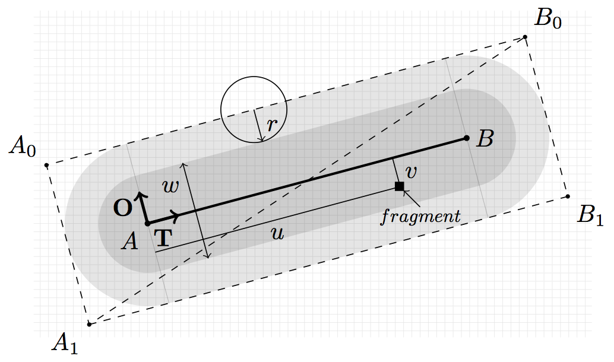

Rendering lines
===============================================================================

.. contents:: .
   :local:
   :depth: 2
   :class: toc chapter-07

Segments
--------

   Figure

   A thick line between A and B with round caps, thickness w and filter
   radius r. Using d = ceil(w + 2.5r), the domain of the (u, v)
   parameterization is given by −d ≤ u ≤ ∥AB∥ + d and −d ≤ v ≤ +d.
              

Polylines
---------

Bézier curves
-------------
