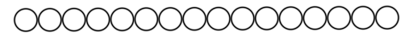
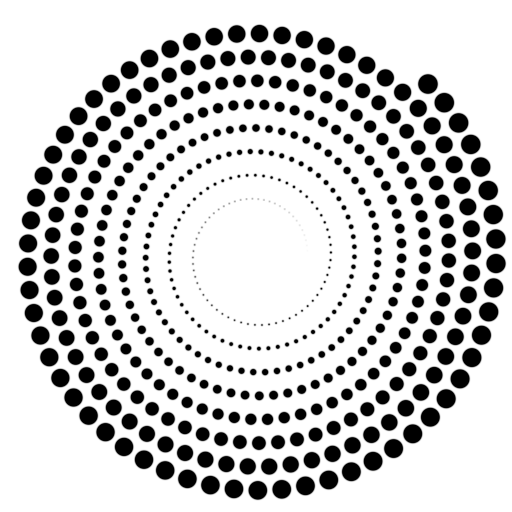
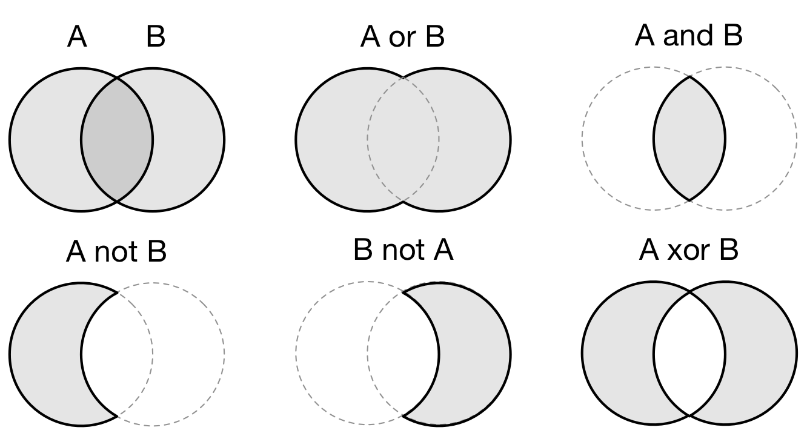

Rendering points
===============================================================================

.. contents:: .
   :local:
   :depth: 2
   :class: toc chapter-07

If you have read the previous chapters, you may have noticed that there exists
actually a `gl.GL_POINTS` drawing primitive and you might have concluded (quite
logically) that displaying points in OpenGL is straightforward. This is partly
true. This primitive can be actually used to display points, but the concept of
point for OpenGL is roughly a non-antialiased, non-rotated, boring and ugly
square. Consequently, if we want to display points like in the teaser image
above , we'll need to take care of pretty much everything.

Dots, discs, circles
-------------------------------------------------------------------------------

We'll use the `gl.GL_POINTS` primitive that actually display a quad whose size
(in pixels) can be specified within the vertex shader` using the `gl_PointSize`
method. If the point is supposed to have a given radius, the quad size must be
slightly larger to take into account the antialias area (1 pixel on each size
in ur case). Futhermore, we can specify a non integer radius and we thus have
to take car of getting the upper bound. So finally, our vertex shader reads:
   
.. code:: glsl

   uniform vec2 resolution;
   
   attribute vec2 center;
   attribute float radius;
   
   varying vec2 v_center;
   varying float v_radius;
   void main()
   {
       v_radius = radius;
       v_center = center;
       gl_PointSize = 2.0 + ceil(2.0*radius);
       gl_Position = vec4(2.0*center/resolution-1.0, 0.0, 1.0);
   }

You may have noticed that we give the window resolution to the shader using a
uniform (that will be updated each time the window size has changed). The goal
is to be able to use window coordinates in python without taking care of the
normalized device coordinate. This transformation will be done inside the
shader. This is important because in the fragment shader, we'll need pixel
coordinates to perform anti-aliasing. This fragment shaders reads:

.. code:: glsl
          
   varying vec2 v_center;
   varying float v_radius;
   void main()
   {
       vec2 p = gl_FragCoord.xy - v_center;
       float a = 1.0;
       float d = length(p) - v_radius + 1.0;
       if(d > 0.0) a = exp(-d*d);
       gl_FragColor = vec4(vec3(0.0), a);
   }

Note that there is a new `gl_FragCoord` variable in this fragment shader. This
variable gives the coordinate of the current fragment in window coordinates
(bottom-left is (0,0)). Without it, the `gl.GL_POINTS` would be useless.

Last, we setup our python program (see `dots-1.py <code/dots-1.py>`_).

.. code:: python

   V = np.zeros(16, [("center", np.float32, 2),
                     ("radius", np.float32, 1)])
   V["center"] = np.dstack([np.linspace(32, 512-32, len(V)),
                            np.linspace(25, 28, len(V))])
   V["radius"] = 15

   window = app.Window(512, 50, color=(1,1,1,1))
   points = gloo.Program(vertex, fragment)
   points.bind(V.view(gloo.VertexBuffer))

   @window.event
   def on_resize(width, height):
       points["resolution"] = width, height

   @window.event
   def on_draw(dt):
       window.clear()
       points.draw(gl.GL_POINTS)

   app.run()

.. figure:: data/dots-1.png
   :figwidth: 50%
   :figclass: right

   Figure

   Discs positionned vertically with a 0.2 pixel increase.

   Figure

   Circles positionned vertically with a 0.2 pixel increase.

You can see the result on the image on the right. Not only the discs are
properly antialiased, but they are also positionned at the subpixel level. In
the image on the right, each disc is actually vertically shifted upward by 0.2
pixels compared to its left neightbour. However, you cannot see any artefacts
(can you?): the discs are similar and properly aligned.

----

.. figure:: data/triangles.mp4
   :loop:
   :autoplay:
   :controls:
   :figwidth: 30%
   :figclass: right

   Figure

.. figure:: data/ellipses.mp4
   :loop:
   :autoplay:
   :controls:
   :figwidth: 30%
   :figclass: right

   Figure

   Figure

   
Markers
-------------------------------------------------------------------------------

.. figure:: data/CSG-markers.png
   :figwidth: 50%
   :figclass: right

   Figure

   Some example of markers constructed using CSG.

Arrows
-------------------------------------------------------------------------------

Spheres
-------------------------------------------------------------------------------

Constructive Solid Geometry
-------------------------------------------------------------------------------

              
   Figure

   Constructive solid geometry (CSG) allows a to create a complex object by using
   Boolean operators to combine simpler objects.

Constructive solid geometry (CSG) is a technique used for modeling in order to
create a complex object by using Boolean operators to combine simpler objects
(primitives). Resulting objects appear visually complex but are actually a
cleverly combined or decombined objects. The teaser image in the `GLSL
References`_ chapter is the result of `complex constructive geometry in 3D
<http://iquilezles.org/www/articles/distfunctions/distfunctions.htm>`_. See
also the Wikipedia entry on `Truth function
<https://en.wikipedia.org/wiki/Truth_function>`_.

This is the reason we did not bother to try to render complex shapes in the
previous section. Using constructive solid geometry, we are free to model
pretty much anything and we'll see that in the markers section below. In the
meantime, we need to define our CSG operations in glsl. The good news is that
it is incredibly simple, just read:

.. code:: glsl

   // Union (A or B)
   float csg_union(float d1, float d2)
   { return min(d1,d2); }

   // Difference (A not B)
   float csg_difference(float d1, float d2)
   { return max(d1,-d2); }

   // Intersection (A and B)
   float csg_intersection(float d1, float d2)
   {  return max(d1,d2); }

   // Exclusion (A xor B)
   float csg_exclusion(float d1, float d2) 
   { return min(max(d1,-d2), max(-d1,d2)); }

And we can check for the result using two circles (the shadertoy link for each
example allows you to play online with them):

   
.. figure:: data/CSG-intersection.png
   :figwidth: 30%
   :figclass: right

   Figure

   | Intersection (A and B)
   | `CSG-intersection.py <code/csg-intersection.py>`_ / `Shadertoy`__

__  https://www.shadertoy.com/view/XllyWn

.. figure:: data/CSG-union.png
   :figwidth: 30%
   :figclass: right

   Figure

   | Union (A or B)
   | `CSG-union.py <code/csg-union.py>`_ / `Shadertoy`__

__  https://www.shadertoy.com/view/4tlyWn

.. figure:: data/CSG-mix.png
   :figwidth: 30%
   :figclass: right

   Figure

   | Two SDF circles (A, B)
   | `CSG-mix.py <code/csg-mix.py>`_ / `Shadertoy`__

__  https://www.shadertoy.com/view/MtfcDr

----

.. figure:: data/CSG-exclusion.png
   :figwidth: 30%
   :figclass: right

   Figure

   | Exclusion (A xor B)
   | `CSG-exclusion.py <code/csg-exclusion.py>`_ / `Shadertoy`__

__  https://www.shadertoy.com/view/4tsyWn
   

.. figure:: data/CSG-difference-2.png
   :figwidth: 30%
   :figclass: right

   Figure

   | Difference (A not B)
   | `CSG-difference-2.py <code/csg-difference-2.py>`_ / `Shadertoy`__

__  https://www.shadertoy.com/view/XtsyWn

.. figure:: data/CSG-difference-1.png
   :figwidth: 30%
   :figclass: right

   Figure

   | Difference (B not A)
   | `CSG-difference-1.py <code/csg-difference-1.py>`_ / `Shadertoy`__

__  https://www.shadertoy.com/view/4llyWn

Boundings boxes
-------------------------------------------------------------------------------
