Rendering lines                                                                
===============================================================================

.. contents:: .
   :local:
   :depth: 2
   :class: toc chapter-09

Lines are most certainly among the most important components in scientific
visualization. They can be used to represents axis, frames, plots, error bars,
contours, grids, etc. Lines and segments are among the most simple geometrical
objects. And yet, they can become quite complex if we consider line thickness,
cap, joint and pattern such as dotted, dashed, etc. In the end, rendering lines
with perfect quality is a lot of work as you'll read below. But it's worth the
effort as illustrated in the teaser image above. This comes from an interactive
demo of glumpy (See the `spiral demo
<https://github.com/glumpy/glumpy/blob/master/examples/spiral.py>`_).
           

Raw Lines                                                                      
-------------------------------------------------------------------------------

As we've seen in the Quickstart_ chapter, OpenGL come with three different line
primitives, namely `gl.GL_LINES` (segments), `gl.GL_LINE_STRIP` (polyline) and
`gl.GL_LINE_LOOP` (closed polyline) and correspond to the hardware
implementation of the `Bresenham algorithm
<https://en.wikipedia.org/wiki/Bresenham%27s_line_algorithm>`_ that can be
written as:

.. code:: python
          
   def line(x0, y0, x1, y1, image, color):
       steep = False
       if abs(x0-x1) < abs(y0-y1): 
           x0, y0 = y0, x0
           x1, y1 = y1, x1
           steep = True
       if x0 > x1:
           x0, x1 = x1, x0
           y0, y1 = y1, y0
       dx = x1-x0
       dy = y1-y0
       error2 = 0
       derror2 = abs(dy)*2
       y = y0
       for x in range(x0,x1+1):
           if steep:
               set_pixel(image, y, x, color)
           else:
               set_pixel(image, x, y, color)
           error2 += derror2; 
           if error2 > dx:
               y += 1 if y1 > y0 else -1 
               error2 -= dx*2 

Rendering raw lines using OpenGL is incredibly fast. Really, really fast.  This
means that it can be used for the rendering of real-time signals as we'll see
in the exercises section.

But as you may have guessed by now, the result is also really, really ugly
because these lines are not antialiased and cannot be wider than 1 pixel. Click
on the image on the right if you want to see it. But you've be warned. It makes
my eyes bleed each time I look at it.

           
Segments                                                                       
-------------------------------------------------------------------------------

.. figure:: images/chapter-09/segment.png
   :figwidth: 50%

   Figure

   A thick line between A and B with round caps, thickness w and filter
   radius r. Using d = ceil(w + 2.5r), the domain of the (u, v)
   parameterization is given by −d ≤ u ≤ ∥AB∥ + d and −d ≤ v ≤ +d.

If we want to render nice lines, we'll have to draw triangles...

More precisely, we need two triangle for a thick (or thin it doesn't really
matter) line segment. The idea is to compute the signed distance to the segment
envelope like we did in the previous section for markers. However, we have a
supplementary difficulty because we also need to draw segment caps as
illustrated on the figure on the right. This means that when we generate our
triangles, we have to take into account antialias area and the cap size (half
the line thickness for one cap).

Let us consider a segment `AB` and let us name `T` the tangent to `AB` and `O`
the normal to `AB`. We want to draw a segment of thickness `w` using an
antialias area (filter radius) `r`. From these information, we can compute the
4 necesssary vertices (screen space `(x,y)`):

* `A₀ =  A - (w/2 + r) * (T+O)`
* `A₁ =  A - (w/2 + r) * (T-O)`
* `B₀ =  B + (w/2 + r) * (T+O)`
* `B₁ =  B + (w/2 + r) * (T-O)`

We can also parameterize these four vertices using a local frame reference
where the origin is `A` and the direction is horizontal (see figure above):

* `A₀/(u,v) = (     -w/2-r,  +w/2-r)`
* `A₁/(u,v) = (     -w/2-r,  -w/2-r)`
* `B₀/(u,v) = (|AB| + w/2-r, +w/2-r)`
* `B₁/(u,v) = (|AB| + w/2-r, -w/2-r)`

This parameterization is very convenient because the distance to the segment
body is given by the `v` component while the cap areas can be identified using
`u < 0 or x > |AB|`.

The next question is where do we compute all these information? We could do it
at the python level of course but it would be slower than computing directly
within the shader. So let's do that instead. For this, we need to distinguish
between each vertex and we need to compute `T` and `O`, meaning each vertex
needs an access to `A`, `B` and a unique identifier to know wheter we're dealing
with A₀, A₁, B₀ or B₁.

* `A₀: A, B, (u,v) = (0,1)`
* `A₁: A, B, (u,v) = (0,0)`
* `B₀: A, B, (u,v) = (1,1)`
* `B₁: A, B, (u,v) = (1,0)`

From this information, we can now compute each vertex position `Pᵢ` and
parameterization `UVᵢ`;

.. code::
   :class: math

   T = (B-A)/|AB|
   O = (-T.y, T.x)
   Pᵢ = A + u*T*|AB| + (2*u-1)*T*(w/2 + r) + (2*v-1)*O*(w/2 + r)
   T = i
   O = j
   UVᵢ = u*T*|AB| + (2*u-1)*T*(w/2 + r) + (2*v-1)*O*(w/2 + r)

Translated in shader code, that gives us:

.. code:: glsl
   
   uniform vec2 resolution;
   uniform float antialias;
   attribute float thickness;
   attribute vec2 p0, p1, uv;
   void main() {
       float t = thickness/2.0 + antialias;
       float l = length(p1-p0);
       float u = 2.0*uv.x - 1.0;
       float v = 2.0*uv.y - 1.0;

       // Screen space
       vec2 T = normalize(p1-p0);
       vec2 O = vec2(-T.y , T.x);
       vec2 p = p0 + uv.x*T*l + u*T*t + v*O*t;
       gl_Position = vec4(2.0*p/resolution-1.0, 0.0, 1.0);

       // Local space
       T = vec2(1.0, 0.0);
       O = vec2(0.0, 1.0);
       p = uv.x*T*l + u*T*t + v*O*t;

In the fragment shader, we can then use the local coordinate to decide on the
color to be rendered by computing the signed distance to the envelope.

.. code:: glsl

   uniform float antialias;
   varying float v_thickness;
   varying vec2 v_p0, v_p1, v_p;
   void main() {
       float d = 0;
       if( v_p.x < 0 )
           d = length(v_p - v_p0) - v_thickness/2.0 + antialias/2.0;
       else if ( v_p.x > length(v_p1-v_p0) )
           d = length(v_p - v_p1) - v_thickness/2.0 + antialias/2.0;
       else
           d = abs(v_p.y) - v_thickness/2.0 + antialias/2.0;
       if( d < 0)
           gl_FragColor = vec4(0.0, 0.0, 0.0, 1.0);
       else if (d < antialias) {
           d = exp(-d*d);
           gl_FragColor = vec4(0.0, 0.0, 0.0, d);
       } 
          
The actual shader is slightly more complicated because we have also to take
care of lines whose thickness is below 1 pixel. In such a case, we consider the
line to be one pixel wide and we use transparency level to suggest that the
line is actually thiner. If you look at the result below (see `agg-segments.py
<code/chapter-09/agg-segments.py>`_), the first few lines have a thickness
below 1 pixel.
       
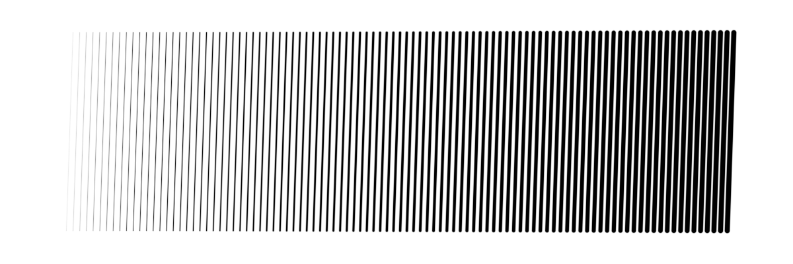

   Figure

   100 antialiased slightly oblique segments whose thickness varies linearly
   from 0.1 pixel to 8 pixels. See
   `agg-segments.py <code/chapter-09/agg-segments.py>`_.

Concerning the segment caps, we have used a round cap, but you're free to use
any cap you like. In fact, you could have used any marker we've seen in
the previous chapter or no caps at all (just discard the fragment in such case).

Lines                                                                          
-------------------------------------------------------------------------------

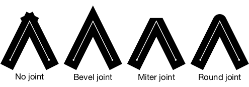

   Figure

   The different line joints.

Polylines (i.e. line made of several segments) is much more difficult to render
than segment because we have to take joints into account as illustrated on the
image on the right. But, even if there appears to exist three different kind of
joints, there are really only two cases to consider: the bevel joint and the
others (round and miter). These cases are different because we can code a
reasonably fast solution for the bevel case while the two others ask for more
work. This is important because for smooth lines, such as Bézier curves (see
below), the fast solution will do the job.

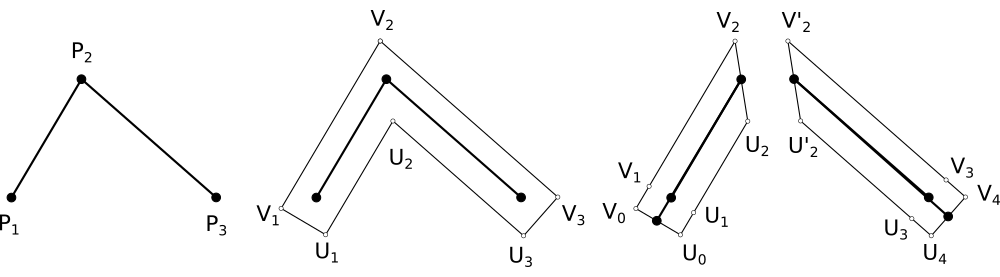

   Figure

   Two different line tesselations.

The reason the fast solution is fast compared to the other one comes from the
number of vertices we need to generate to render a thick line. In the fast
case, we'll need only 2×n vertices while in the other, we'll need 4×n vertices
(and a lot of tests inside the shader).
   

Smooth lines                                                                   
+++++++++++++++++++++++++++++++++++++++++++++++++++++++++++++++++++++++++++++++

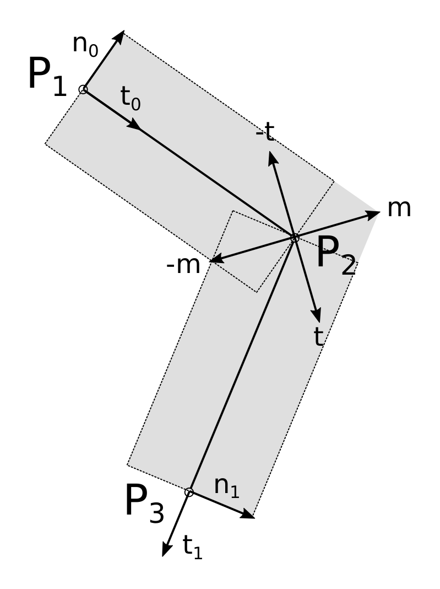

   Figure

   Joint detail

In order to compute the final position of a vertex inside the vertex shader, we
need to have access to the previous and the next vertex as shown on the figure
on the right. To compute `m` at `P₂` we need to have access to `P₁` and
`P₃`. Furthermore, each vertex needs to be doubled and we need to take care of
line start and end. To do that, we'll use a single vertex buffer that is baked
such that we each vertex is doubled and two extra vertices are put at start and
end::

   ┌───┬───┬───┬───┬───┬───┬───┬───┬───┬───┐
   │ 0 │ 0 │ 1 │ 2 │ 3 │ 4 │ 5 │ 6 │ 7 │ 7 │
   └───┴───┴───┴───┴───┴───┴───┴───┴───┴───┘
   
   └──────────── prev ─────────────┘
   
       └──────────── curr ─────────────┘
       
           └──────────── next ─────────────┘

The goal of these two extra vertices is to use the same buffer for passing the
`prev`, `curr` and `next` attributes to the vertex shader using the same
underlying buffer. Their content will depend on whether the line is closed or
not. It is to be noted that each vertex has four coordinates. The `(x,y)` gives
the actual vertex coordinates, the `z=+1/-1` coordinate identifies which vertex
we're dealing with (`Vᵢ` or `Uᵢ` on the figure) and the last coordinate is the
curvilinear coordinate along the line. This last one will be useful to know if
we're within the start cap area, the end cap area or inside the
body. Furthermore, it can be used for pattern or texturing (see section
Patterns_ below).

Taking all these constraints into account, the line preparation reads:

.. code:: python

   def bake(P, closed=False):
       epsilon = 1e-10
       n = len(P)
       if closed and ((P[0]-P[-1])**2).sum() > epsilon:
           P = np.append(P, P[0])
           P = P.reshape(n+1,2)
           n = n+1
       V = np.zeros(((1+n+1),2,4), dtype=np.float32)
       V_prev, V_curr, V_next = V[:-2], V[1:-1], V[2:]
       V_curr[...,0] = P[:,np.newaxis,0]
       V_curr[...,1] = P[:,np.newaxis,1]
       V_curr[...,2] = 1,-1
       L = np.cumsum(np.sqrt(((P[1:]-P[:-1])**2).sum(axis=-1))).reshape(n-1,1)
       V_curr[1:,:,3] = L
       if closed:
           V[0], V[-1] = V[-3], V[2]
       else:
           V[0], V[-1] = V[1], V[-2]
       return V_prev, V_curr, V_next, L[-1]

Using this baking, it is now realtively easy to compute vertex position from
within the vertex shader. The only difficulty being to parameterize properly
the vertex such as to have all information to perform the antialiasing inside
the fragment shader:

.. code:: glsl

   uniform vec2 resolution;
   uniform float antialias, thickness, linelength;
   attribute vec4 prev, curr, next;
   varying vec2 v_uv;
   
   void main() {
       float w = thickness/2.0 + antialias;
       vec2 p;
       vec2 t0 = normalize(curr.xy - prev.xy);
       vec2 t1 = normalize(next.xy - curr.xy);
       vec2 n0 = vec2(-t0.y, t0.x);
       vec2 n1 = vec2(-t1.y, t1.x);

       // Cap at start
       if (prev.xy == curr.xy) {
           v_uv = vec2(-w, curr.z*w);
           p = curr.xy - w*t1 + curr.z*w*n1;
       // Cap at end
       } else if (curr.xy == next.xy) {
           v_uv = vec2(linelength+w, curr.z*w);
           p = curr.xy + w*t0 + curr.z*w*n0;
       // Body
       } else {
           vec2 miter = normalize(n0 + n1);
           float dy = w / dot(miter, n1);
           v_uv = vec2(curr.w, curr.z*w);
           p = curr.xy + dy*curr.z*miter;
       }
       gl_Position = vec4(2.0*p/resolution-1.0, 0.0, 1.0);
   }

Adn the fragment shader reads:
   
.. code:: glsl

   uniform float antialias, thickness, linelength;
   varying vec2 v_uv;

   void main() {
       float d = 0;
       float w = thickness/2.0 - antialias;
       // Cap at start
       if (v_uv.x < 0)
           d = length(v_uv) - w;
       // Cap at end
       else if (v_uv.x >= linelength)
           d = length(v_uv - vec2(linelength,0)) - w;
       // Body
       else
           d = abs(v_uv.y) - w;

       if( d < 0) {
           gl_FragColor = vec4(0.0, 0.0, 0.0, 1.0);
       } else {
           d /= antialias;
           gl_FragColor = vec4(0.0, 0.0, 0.0, exp(-d*d));
       }
   }

.. note::

   Note that we'll be using the GL_TRIANGLE_STRIP even though it would be
   better to use GL_TRIANGLES and to compute the relevant indices. But I feel
   lazy right now.

Putting all together, we can draw some nice and smooth lines (see `linestrip.py
<code/chapter-09/linestrip.py>`_). Note that for closed lines such as the star
below, first and last vertex needs to be the same (but it is taken care of in
the `bake` function).
   
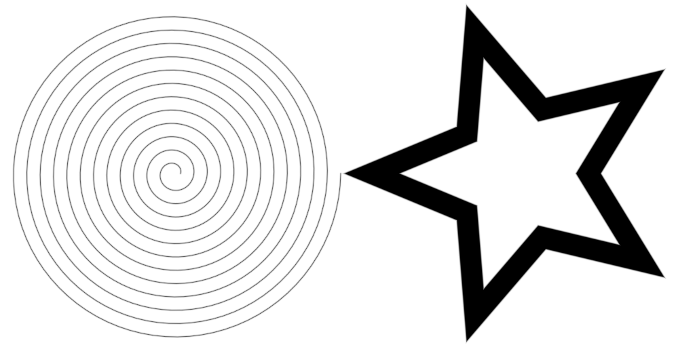

   Figure

   Smooth lines with bevel joints (see `linestrip.py <code/chapter-09/linestrip.py>`_)

Broken lines                                                                   
+++++++++++++++++++++++++++++++++++++++++++++++++++++++++++++++++++++++++++++++

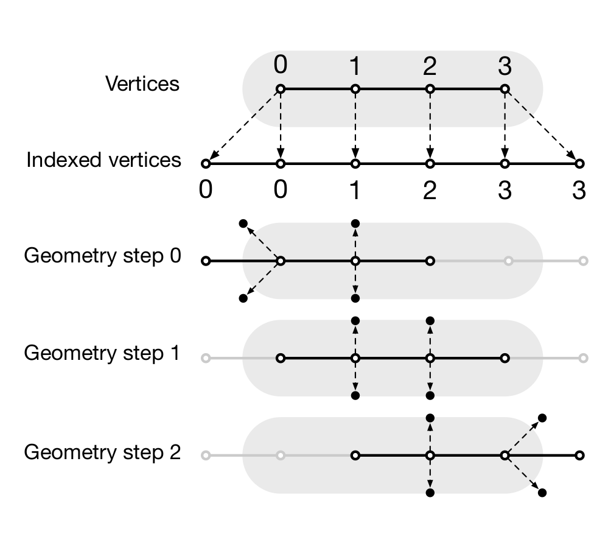
              
   Figure

   A geometry shader can be used to generate four vertices at each stage and
   allows to tesselate and parameterize a line.
   
Broken lines are a bit more difficult because we need a different tesselation
just to be able to handle miter and round joints properly in the fragment
shader. To be able to do this, we need to know from within the fragment shader
if a given fragment is inside the joint area or not. This requires a specific
parameterization that relies on having a different tesselation with 4×n
vertices instead of 2×n. I won't explain all the details here but only provide
the final result that you can found in `geom-path.py
<code/chapter-09/geom.path.py>`_.

If you look at the sources, you'll see I'm using a geometry shader, which is a
new type of shader that is not officially available in GL ES 2.0 but which is
nonetheless available on a wide number of implementations. This geometry shader
offers the possibility to create new vertex which is quite convenient in our
case because for each couple of vertices we send to the GPU, the geometry
shader will actually create four vertices (see figure above). We thus save the
CPU time of "quadrupling" vertices as we did in the previous section. To be
able to this, we have to use `gl.GL_LINES_ADJACENCY_EXT` and indicate OpenGL
we'll generate four vertices at each stage, just before the vertex shader:

.. code:: python
          
   geometry = gloo.GeometryShader(geometry, 4,
                                  gl.GL_LINES_ADJACENCY_EXT,
                                  gl.GL_TRIANGLE_STRIP)

                                  
Inside the geometry shader, we now have access to four consecutive vertices (in
the sense of the provided indices) that can be used to compute the actual
position of a given segment of the line. During rendering, we also have to use
the same primitives:

.. code:: python

   @window.event
   def on_draw(dt):
       window.clear()
       program.draw(gl.GL_LINE_STRIP_ADJACENCY_EXT, I)

I won't further describe the method that is a bit complicated but you can all
the details in the provided demo script. See the caption of the image below.
       

              
   Figure

   Different line joints using a geometry shader. See
   `geom-path.py <code/chapter-09/geom.path.py>`_.

Bézier curves                                                                  
+++++++++++++++++++++++++++++++++++++++++++++++++++++++++++++++++++++++++++++++

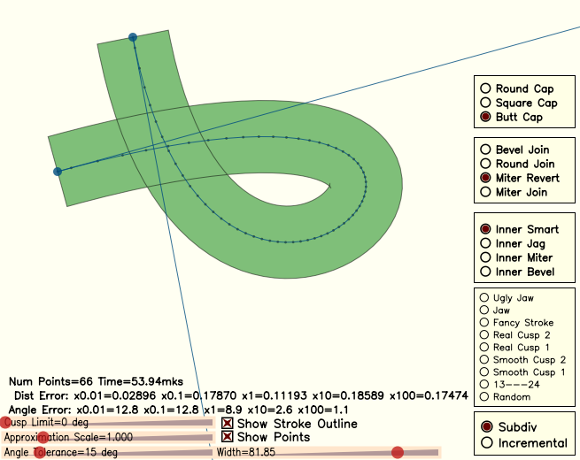
              
   Figure

   Bézier demo from the `antigrain geometry library <http://antigrain.com/>`_

There is a huge litterature on Bézier curves and a huge litterature on GPU
Bézier curves as well (+ lot of patents). I won't explain everything here
because it would require a whole book and I'm not sure I understand every
aspect anyway. If you're interested in the topic, you can have a look at `A
Primer on Bézier curves <https://pomax.github.io/bezierinfo>`_ by Mike
Kamermans (Pomax) that explain pretty much everything but GPU
implementation. For GPU implementation, you can have a look at shadertoy and do
a search using the "Bézier" or "bezier" keyword (I even commited `one
<https://www.shadertoy.com/view/4dfSDf>`_ myself).

For the time being, we'll use an approximation of Bézier curves using an
`adaptive subdivision <http://antigrain.com/research/adaptive_bezier/>`_ as
designed by Maxim Shemarev (and translated in Python by me, see `curves.py
<code/chapter-09/curves.py>`_). You can see on the images below that this
method provides a very good approximation in a reasonable number of segments
(third figure on the right).

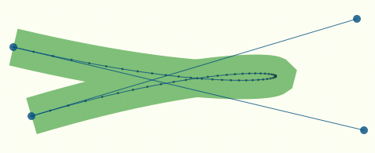

   Figure

   Approximation of a Bézier curves with too few vertices (n=52).

   
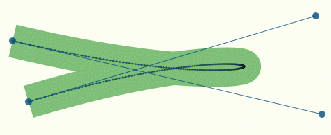
              
   Figure

   Approximation of a Bézier curves with too many vertices (n=210).

   
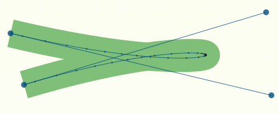
              
   Figure

   Adaptive subdivision of a Bézier curves (n=40).
   

Consequently, for drawing a Bézier curve, we just need to approximate as line
segments, bake those segments and render them as shown below (using
bevel joint, see `bezier.py <code/chapter-09/bezier.py>`_):

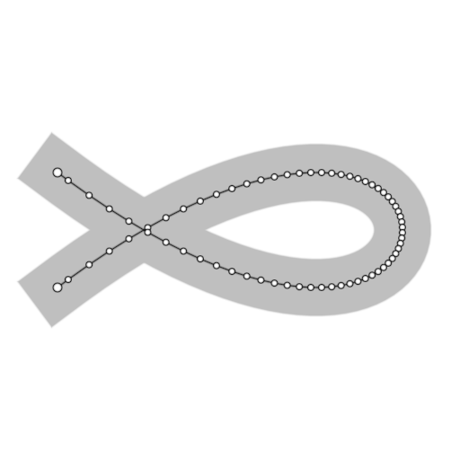

   Figure

   
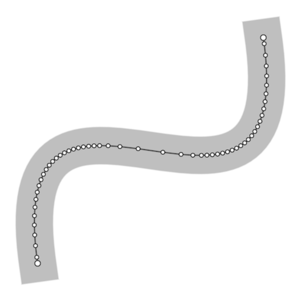

   Figure

   
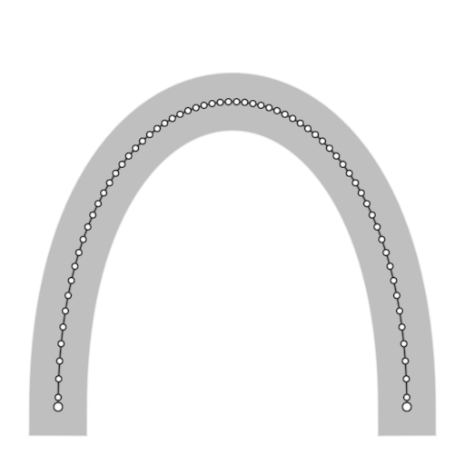

   Figure

   
Patterns                                                                      
-------------------------------------------------------------------------------

Simple dotted pattern                                                          
+++++++++++++++++++++++++++++++++++++++++++++++++++++++++++++++++++++++++++++++

.. figure:: movies/chapter-09/linestrip-dotted.mp4
   :loop:
   :autoplay:
   :controls:
   :figwidth: 35%
            
   Figure

   An animated dotted animated computed inside the fragment shader. See
   `linestrip-dotted.py <code/chapter-09/linestrip-dotted.py>`_.

Rendering a simple dotted pattern is surprinsingly simple. If you look at the
fragmen code from the smooth line sections, the computation of the sidnged
distance reads:

.. code:: glsl

   ...
   // Cap at start
   if (v_uv.x < 0)
       d = length(v_uv) - w;
   // Cap at end
   else if (v_uv.x >= linelength)
       d = length(v_uv - vec2(linelength,0)) - w;
   // Body
   else
       d = abs(v_uv.y) - w;
   ...
       
We can slightly change this code in order to compute the signed distance to
discs whose centers area spread over the whole. Do you remember that we took
care of computing the line curvilinear coordinate? Having centers spread along
this line is then just a matter of a modulo.

.. code:: glsl

   uniform float phase;
   ...
   float spacing = 1.5;
   float center = v_uv.x + spacing/2.0*thickness
                - mod(v_uv.x + phase + spacing/2.0*thickness, spacing*thickness);
   // Discard uncomplete dot at the end of the line
   if (linelength - center < thickness/2.0)
       discard;
   // Discard uncomplete dot at the start of the line
   else if (center < thickness/2.0)
       discard;
   else
       d = length(v_uv - vec2(center,0.0)) - w;
   ...

.. figure:: movies/chapter-09/linestrip-spaded.mp4
   :loop:
   :autoplay:
   :controls:
   :figwidth: 35%

   Figure

   An animated dotted animated computed inside the fragment shader. See
   `linestrip-spaded.py <code/chapter-09/linestrip-spaded.py>`_.

The animation is obtained by slowly increasing the phase that makes all dot
centers to move along the lines.

By the way, you may have noticed that I've been using the simplest marker I
could think of (disc) for the example above. But we could have used any of the
marker from the previous chapter actually. For example, on the figure on the
right, I use the spade marker and I've added a fading at line start and end to
prevent the sudden apparition/disparition of a marker.
   

Arbitrary dash patterns                                                        
+++++++++++++++++++++++++++++++++++++++++++++++++++++++++++++++++++++++++++++++

Having arbitrary dashed patterns with possibly very thick lines and arbitrary
joints is quite a difficult problem if we want to have an (almost) pure GPU
implementation. It is actually so hard that I had to write an article
explaining how this can be done. If you want to know more, just read See
"`Shader-based Antialiased Dashed Stroke Polylines
<http://jcgt.org/published/0002/02/08/>`_" for a full explanation as well as
`Python implementation <http://jcgt.org/published/0002/02/08/code.zip>`_. The
result is illustrated on the movies below.

.. figure:: movies/chapter-09/stars.mp4
   :loop:
   :autoplay:
   :controls:
   :figwidth: 30%
   :figclass: left
            
   Figure

.. figure:: movies/chapter-09/sphere.mp4
   :loop:
   :autoplay:
   :controls:
   :figwidth: 30%
   :figclass: left
            
   Figure

.. figure:: movies/chapter-09/tiger.mp4
   :loop:
   :autoplay:
   :controls:
   :figwidth: 30%
   :figclass: left
            
   Figure

Unfortunately, at the time of writing, these arbitrary dash patterns lines have
not yet been implemented in glumpy. You're thus more than welcome to make a
PR. Contact me if you're interested.

3D lines                                                                      
-------------------------------------------------------------------------------

.. figure:: movies/chapter-09/linestrip-3d.mp4
   :loop:
   :autoplay:
   :controls:
   :figwidth: 35%
   :figclass: right

   Figure

   A loxodrome (spherical spiral) with fixed line thickness. See
   `linestrip-3d.py <code/chapter-09/linestrip-3d.py>`_

You certainly have noticed that until now, we've been dealing only with lines
in the two-dimensional screen space, using two-dimensional coordinates `(x,y)`
to describe positions. The thickness of such lines is rather intuitive because
they live in the screen space.

In three dimensions however, the problem is different. Mathematically, a line
has no thickness per se and the thick lines we've been drawing so far were
actually ribbon. In 3D, we have the choice to consider a thick line to be a
ribbon or a tube. But there is actually a third, and simpler option, which is
to consider than the line is a ribbon that is always facing the camera.

Fixed apparent thickness                                                       
+++++++++++++++++++++++++++++++++++++++++++++++++++++++++++++++++++++++++++++++

For a fixed apparent thickness, the method is (almost) straighforward:

1. Apply transformation and get NDC coordinates
2. Convert NDC coordinates to viewport coordinates
3. Thicken line in viewport space
4. Transmit the resulting vertex   

Let's start with the conversion from NDC (normalized device coordinates) to
screen:

.. code:: glsl

   uniform vec2 viewport;
   uniform mat4 model, view, projection;
   attribute vec3 prev, curr, next;
          
   ...
          
   // Normalized device coordinates
   vec4 NDC_prev = projection * view * model * vec4(prev.xyz, 1.0);
   vec4 NDC_curr = projection * view * model * vec4(curr.xyz, 1.0);
   vec4 NDC_next = projection * view * model * vec4(next.xyz, 1.0);

   // Viewport (screen) coordinates
   vec2 screen_prev = viewport * ((NDC_prev.xy/NDC_prev.w) + 1.0)/2.0;
   vec2 screen_curr = viewport * ((NDC_curr.xy/NDC_curr.w) + 1.0)/2.0;
   vec2 screen_next = viewport * ((NDC_next.xy/NDC_next.w) + 1.0)/2.0;

From these screen coordinates, we can compute the final position as we did
previously with the noticeable difference that we also need to use `z`
coordinate from the NDC coordinate.

.. code:: glsl

   vec2 position;
   float w = thickness/2.0 + antialias;
   vec2 t0 = normalize(screen_curr.xy - screen_prev.xy);
   vec2 n0 = vec2(-t0.y, t0.x);
   vec2 t1 = normalize(screen_next.xy - screen_curr.xy);
   vec2 n1 = vec2(-t1.y, t1.x);
   v_uv = vec2(uv.x, uv.y*w);
   if (prev.xy == curr.xy) {
       v_uv.x = -w;
       position = screen_curr.xy - w*t1 + uv.y*w*n1;
   } else if (curr.xy == next.xy) {
       v_uv.x = linelength+w;
       position = screen_curr.xy + w*t0 + uv.y*w*n0;
   } else {
       vec2 miter = normalize(n0 + n1);
       // The max operator avoid glitches when miter is too large
       float dy = w / max(dot(miter, n1), 1.0);
       position = screen_curr.xy + dy*uv.y*miter;
   }

   // Back to NDC coordinates
   gl_Position = vec4(2.0*position/viewport-1.0, NDC_curr.z/NDC_curr.w, 1.0);

And we'll use the fragment shader we've using for smooth lines. Have a look at
`linestrip-3d.py <code/chapter-09/linestrip-3d.py>`_ for the full
implementation.
   

Varying apparent thickness                                                     
+++++++++++++++++++++++++++++++++++++++++++++++++++++++++++++++++++++++++++++++

.. figure:: movies/chapter-09/linestrip-3d-better.mp4
   :loop:
   :autoplay:
   :controls:
   :figwidth: 35%
   :figclass: right
            
   Figure

   A loxodrome (spherical spiral) with subtle varying colors and thickness. See
   `linestrip-3d-better.py <code/chapter-09/linestrip-3d-better.py>`_

   
We can refine the rendering by considering the orientation of the line. This
orientation is given by the normal to the surface, and because our spiral is
drawn over the surface of a sphere, the normal to the surface is easy to
compute because it is the same coordinate as the point. But, instead of
applying the full transformation, we'll restict it to the model transformation
(i.e. no view nor projection) resulting in a normal vector where the `z`
coordinate indicates if the shape is orienting towards the camera. Then,
depending on this, we can modulate the thickness or the color of the line as
shown on the figure on the right. In this example, we modify the thickness in
the vertex shader and the color in the fragment shader.

.. code:: glsl

   vec4 normal = model*vec4(curr.xyz, 1.0);
   v_normal = normal.xyz;
   if (normal.z < 0)
       v_thickness = thickness/2.0;
   else
       v_thickness = thickness*(pow(normal.z,.5)+1)/2.;

   
Exercises                                                                      
-------------------------------------------------------------------------------

Realtime signals                                                               
+++++++++++++++++++++++++++++++++++++++++++++++++++++++++++++++++++++++++++++++
 
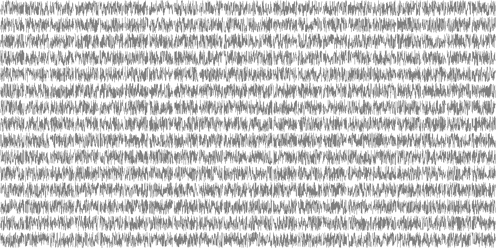

   Figure

   20*15 signals of 1000 points each.

Let us consider a simple example where we have to display 300 (15*20) signals
made of 1,000 points each (300,000 vertices). What could be the fastest way to
display them using raw OpenGL lines?

Solution: `signals.py <code/chapter-09/signals.py>`_

Variable thickness                                                             
++++++++++++++++++++++++++++++++++++++++++++++++++++++++++++++++++++++++++++++++

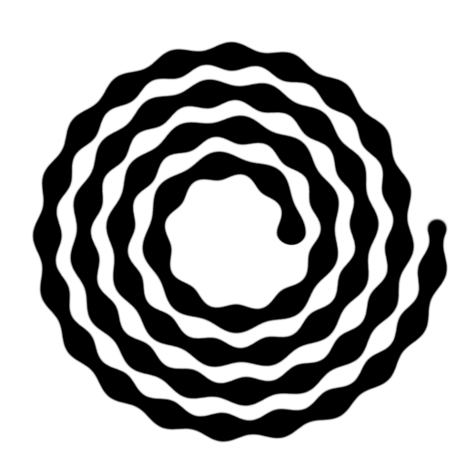

   Figure

   Linestrip with varying thickness

We've seen in the `Smooth lines`_ section how to render smooth lines using
bevel joints. The thickness of the resulting line was (implicitly)
constant. How would you transform the shader to have a varying thickness as
illustrated on the figure on the right?

Solution:
`linestrip-varying-thickness.py <code/chapter-09/linestrip-varying-thickness.py>`_

----
