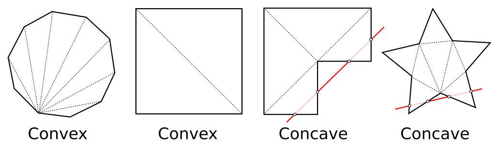
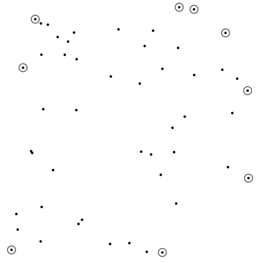
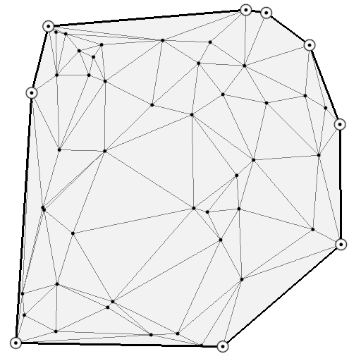
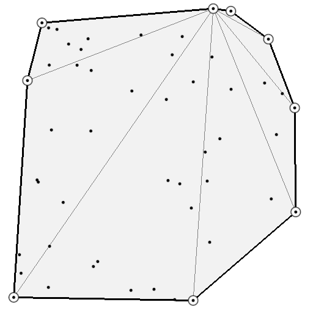
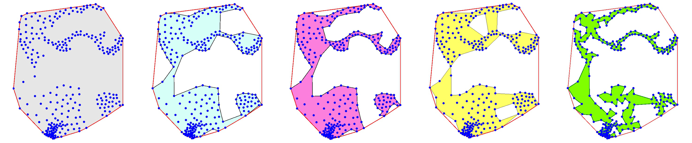
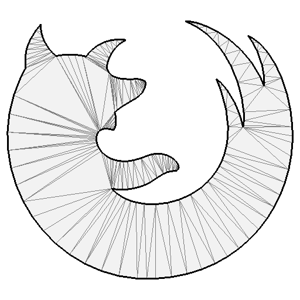
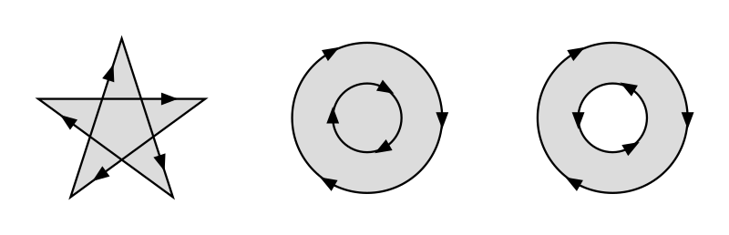
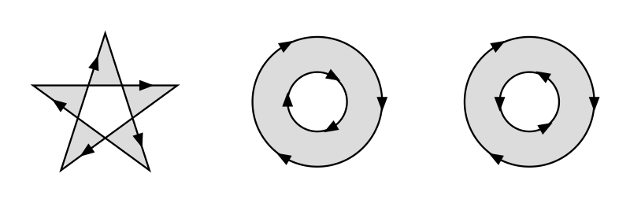
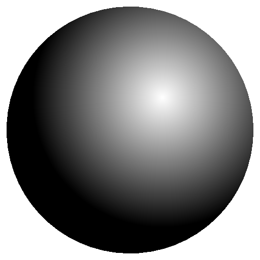
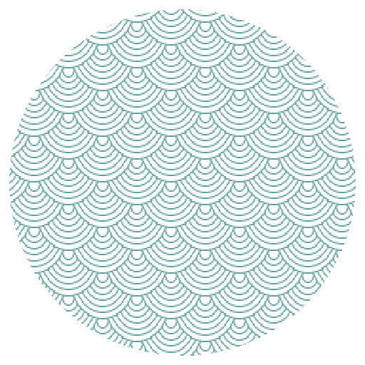

Rendering polygons                                                             
===============================================================================

.. contents:: .
   :local:
   :depth: 2
   :class: toc chapter-10

Polygons are an important topic for scientific visualization because they can
be used to display bars, histograms, charts, filled plots, etc. Displaying
polygons using OpenGL is really fast, provided we have the proper
triangulation. The teaser image comes from the `tiger demo
<https://github.com/glumpy/glumpy/blob/master/examples/tiger.py>`_ of glumpy.

Triangulation                                                                  
-------------------------------------------------------------------------------

In order to draw a polygon, we need to triangulate it, i.e., we have to
decompose it into a sum of non overlapping triangles. To do that, we have to
consider whether the polygon is convex or concave:

To know if a given polygon is concave or convex, it is rather easy. Convex
polygons have all their diagonals contained inside, while it is not true for
concave polygons, i.e. you can find two summits such that when you connect
them, the segment is outside the polygon. Another test is to find a straight
line that cross a concave polygon at more than two points as shown on the
figure above with the red lines.

Convex polygons
+++++++++++++++

For convex polygons, we have to consider two cases:

1. points are ordered and describe the contour of the polygon
2. points are unordered and spread randomly onto the 2d plane

For the second case, we can use scipy to compute the convex hull of the points
such as to be in the first case situation:

.. code:: python

   import numpy as np
   import scipy.spatial

   P = np.random.uniform(-1.0, 1.0, (100,2))
   P = P[scipy.spatial.ConvexHull(P).vertices]

From this ordered set of vertices describing the contour, it is now easy to
render the polygon using the `gl.GL_TRIANGLE_FAN` primitives:

.. code:: python

   @window.event
   def on_draw(dt):
       window.clear()
       polygon.draw(gl.GL_TRIANGLE_FAN)

You can see on the figures below that it is better to use only the convex hull
points to compute the triangulation. You can also check that all other points
are actually inside the polygon area.

       

   Figure

   A cloud of random points. Convex hull points have been highlighted.
   See `convex-polygon-point.py <code/chapter-10/convex-polygon-point.py>`_

   Figure

   A Delaunay triangulation with a lof of useless triangles.
   See `convex-polygon.py <code/chapter-10/convex-polygon.py>`_

   

   Figure

   A triangulation restricted to points belonging to the convex hull.
   See `convex-polygon-fan.py <code/chapter-10/convex-polygon-fan.py>`_

Concave polygons
++++++++++++++++

For concave polygons, we could consider the two aforementionned cases where
points are either ordered and describe the contour of the polygon or points are
unordered and spread randomly onto the 2d plane. However, for the latter case,
things become more difficult because the solution is not unique as shown on the
figure below.

   Figure

   The concave hull (or `alpha shape
   <https://en.wikipedia.org/wiki/Alpha_shape>`_) of a set of points is not
   unique. Images by `Martin Laloux
   <http://www.portailsig.org/content/sur-la-creation-des-enveloppes-concaves-concave-hull-et-les-divers-moyens-d-y-parvenir-forme>`_.

This is the reason why we'll restrict ourselves to the first case, that is, we
have a set or ordered points describing the contour of a concave polygon. But
even in such simple case, triangulation is not obvious and we'll thus need a
dedicated library. We'll use the `triangles <http://dzhelil.info/triangle/>`_
library but there are others:

   Figure

   The firefox logo, tesselated (Bézier curves converted to segments) and
   triangulated. See `firefox.py <code/chapter-10/firefox.py>`_

.. code:: python
          
   def triangulate(vertices):
       n = len(vertices)
       segments = (np.repeat(np.arange(n+1),2)[1:-1]) % n
       T = triangle.triangulate({'vertices': vertices,
                                 'segments': segments}, "p")
       return T["vertices"], T["triangles"]

 
On the image on the right, we've parsed (see `svg.py
<code/chapter-10/svg.py>`_) the firefox icon SVG path and tesselated the Bézier
curves into line segments. Then we have triangulated the resulting path and
obtained the displayed triangulation using `gl.GL_TRIANGLES`. See `firefox.py
<code/chapter-10/firefox.py>`_
   

Fill rule                                                                      
-------------------------------------------------------------------------------

The fill-rule property is used to specify how to paint the different parts of a
shape. As explained in the `SVG specification`_, *for a simple,
non-intersecting path, it is intuitively clear what region lies "inside";
however, for a more complex path, such as a path that intersects itself or
where one subpath encloses another, the interpretation of "inside" is not so
obvious. The fill-rule property provides two options for how the inside of a
shape is determined: non-zero and even-odd.*

   Figure

   From the `SVG Specification`_: *The nonzero fill rule determines the
   "insideness" of a point on the canvas by drawing a ray from that point to
   infinity in any direction and then examining the places where a segment of
   the shape crosses the ray.*
   

   Figure

   From the `SVG Specification`_: *The evenodd fill rule determines the
   "insideness" of a point on the canvas by drawing a ray from that point to
   infinity in any direction and counting the number of path segments from the
   given shape that the ray crosses.*

----

To enforce the fill-rule property, we'll need to use the `stencil buffer
<https://www.khronos.org/opengl/wiki/Stencil_Test>`_ that allows to have
per-sample operation and test performed after the fragment shader
stage. Depending on the `stencil function
<https://www.khronos.org/registry/OpenGL-Refpages/gl4/html/glStencilFunc.xhtml>`_
and `stencil operation
<https://www.khronos.org/registry/OpenGL-Refpages/gl4/html/glStencilOp.xhtml>`_
we'll define, we can control precisely how a shape is rendered. But first, we
need to tell OpenGL we'll be using a stencil buffer. In glumpy, the default is
to have no stencil buffer, that is, the default bit depth of the stencil buffer
is zero. To activate it, we thus simply need to specify some non-zero stencil
bit depth (e.g. 8 for 256 possible values):

.. code:: python
   
   config = app.configuration.Configuration()
   config.stencil_size = 8
   window = app.Window(config=config, width=512, height=512)

   @window.event
   def on_init():
       gl.glEnable(gl.GL_STENCIL_TEST)

Note that we also need to activate the stencil test in the `on_init` window event.

.. _SVG Specification: https://www.w3.org/TR/SVG/painting.html

Non-zero fill rule
++++++++++++++++++

The non-zero fill rule implementation is easy because it corresponds to the
default triangulation we've just seen above and no extra work is necessary.

Odd-even fill rule
++++++++++++++++++

In order to enforce the odd-even fill rule, we need to use a 2-pass
rendering. The first pass will write to the stencil buffer according to the
operation we define and the second pass will read the stencil buffer in order
to decide if a fragment need to be painted or not. For the first pass, we thus
disable depth and color writing and we instruct OpenGL to increment stencil
value if a shape is drawn clockwise (CW) and to decrement it for counter clock
wise shapes (CCW):

.. code:: python
          
    # Disable color and depth writing
    gl.glColorMask(gl.GL_FALSE, gl.GL_FALSE, gl.GL_FALSE, gl.GL_FALSE)
    gl.glDepthMask(gl.GL_FALSE)

    # Always write to stencil
    gl.glStencilFunc(gl.GL_ALWAYS, 0, 0)
    
    # Increment value for CW shape
    gl.glStencilOpSeparate(gl.GL_FRONT, gl.GL_KEEP, gl.GL_KEEP, gl.GL_INCR)
    
    # Decrement value for CCW shape
    gl.glStencilOpSeparate(gl.GL_BACK,  gl.GL_KEEP, gl.GL_KEEP, gl.GL_DECR)

Once the stencil buffer has been written, we can use the stored value to decide
for the condition to be tested for writing to the render buffer. Using the
`glStencilFunc` function, we can express virtually any condition we want:

    =============== ================================================
    `glStencilFunc` `(func, ref, mask)`
    =============== ================================================
    `GL_NEVER`      Always fails
    --------------- ------------------------------------------------
    `GL_LESS`       Passes if ( ref & mask ) <  ( stencil & mask )
    --------------- ------------------------------------------------
    `GL_LEQUAL`     Passes if ( ref & mask ) <= ( stencil & mask )
    --------------- ------------------------------------------------
    `GL_GREATER`    Passes if ( ref & mask ) >  ( stencil & mask )
    --------------- ------------------------------------------------
    `GL_GEQUAL`     Passes if ( ref & mask ) >= ( stencil & mask )
    --------------- ------------------------------------------------
    `GL_EQUAL`      Passes if ( ref & mask ) =  ( stencil & mask )
    --------------- ------------------------------------------------
    `GL_NOTEQUAL`   Passes if ( ref & mask ) != ( stencil & mask )
    --------------- ------------------------------------------------
    `GL_ALWAYS`     Always passes
    =============== ================================================

    

   Figure

   Odd-even fill rule using the stencil buffer.
   See `winding.py <code/chapter-10/winding.py>`_

For the actual odd-even fill rule, we only need to test for the last bit in the
stencil buffer:

.. code:: python
          
    # Enable color and depth writing
    gl.glColorMask(gl.GL_TRUE, gl.GL_TRUE, gl.GL_TRUE, gl.GL_TRUE)
    gl.glDepthMask(gl.GL_TRUE)

    # Actual stencil test
    # Odd-even
    gl.glStencilFunc(gl.GL_EQUAL, 0x01, 0x1)

    # Non zero
    # gl.glStencilFunc(gl.GL_NOTEQUAL, 0x00, 0xff)
    
    # Positive
    # gl.glStencilFunc(gl.GL_LESS, 0x0, 0xff)

    # Stencil operation (for both CW and CCW shapes)
    gl.glStencilOp(gl.GL_KEEP, gl.GL_KEEP, gl.GL_KEEP)

    
Exercises                                                                      
-------------------------------------------------------------------------------

Polygon gradients
+++++++++++++++++

   Figure

   Radial gradient.

The SVG specification considers two kind of color gradients (i.e. smooth
transition from one color to another), radial and linear. Using the vertices
coordinates inside the shader, it is thus very easy to create those gradients.
In order to do that, you need to compute (for every fragment) a scalar that
indicate tells the amount of color 1 and color 2 respectively and try to render
the image on the right.

Solution: `radial-gradient.py <code/chapter-10/radial-gradient.py>`_

Polygon Patterns
++++++++++++++++

   Figure

   Patterns.

We can also use any texture to pain the polygon. It's only a matter of
assigning the right texture to polygon vertices. Try to render the image on the
right using this `texture <images/chapter-10/wave.png>`_

Solution: `pattern.py <code/chapter-10/pattern.py>`_

Antialiasing                                                                   
++++++++++++

As you have noticed, the polygon we've renderered so far are not antialised
(because we've been using only raw triangles). While it might be possible to
write a specific shader to take car of antiliasing on the border, it is far
more easier to draw an antialiased polygon in two steps. First, we draw the
interio of the polygon and then, we render a half-line on the contour. We need
a half-line because we do not want the line to cover the already rendered
polygon. There is no real difficulty and this is a good exercise. I will use
the best proposed solution to be included here.

