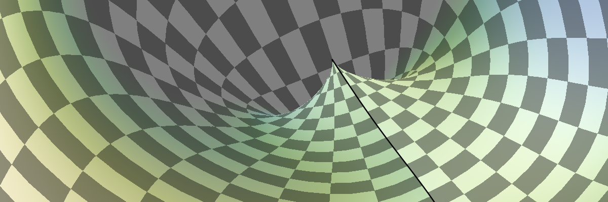

Python & OpenGL for Scientific Visualization
============================================

| Copyright (c) 2017 Nicolas P. Rougier
| **License**: Creative Commons Attribution 4.0 International (CC BY-NC-SA 4.0)
| **Website**: http://www.labri.fr/perso/nrougier/python+opengl
|

Python and OpenGL have a long but complicated story. It used to be really easy
to program something using the fixed-pipeline and libraries such as Pyglet but
things have became more difficult with the introduction of the dynamic graphic
pipeline in 2004. The goal of this book is to reconciliate Python programmers
with OpenGL, providing both an introduction to modern OpenGL and a set of basic
and advanced techniques in order to achieve both fast, scalable & beautiful
scientific visualizations. The book uses the GLES 2.0 API which is the most
simple API for accessing the programmable graphic pipeline. It does not cover
up-to-date OpenGL techniques but it is sufficient to achieve great
visualisation. In fact, modern OpenGL allows to control pretty much everything
in the pipeline and the goal of this book is to explain several techniques
dedicated to scientific visualisation such as isolines, markers, colormaps,
arbitrary transformations but there are actually many more techniques to be
discovered and explained in this open-access book. And of course, everything
will be fast and beautiful.

